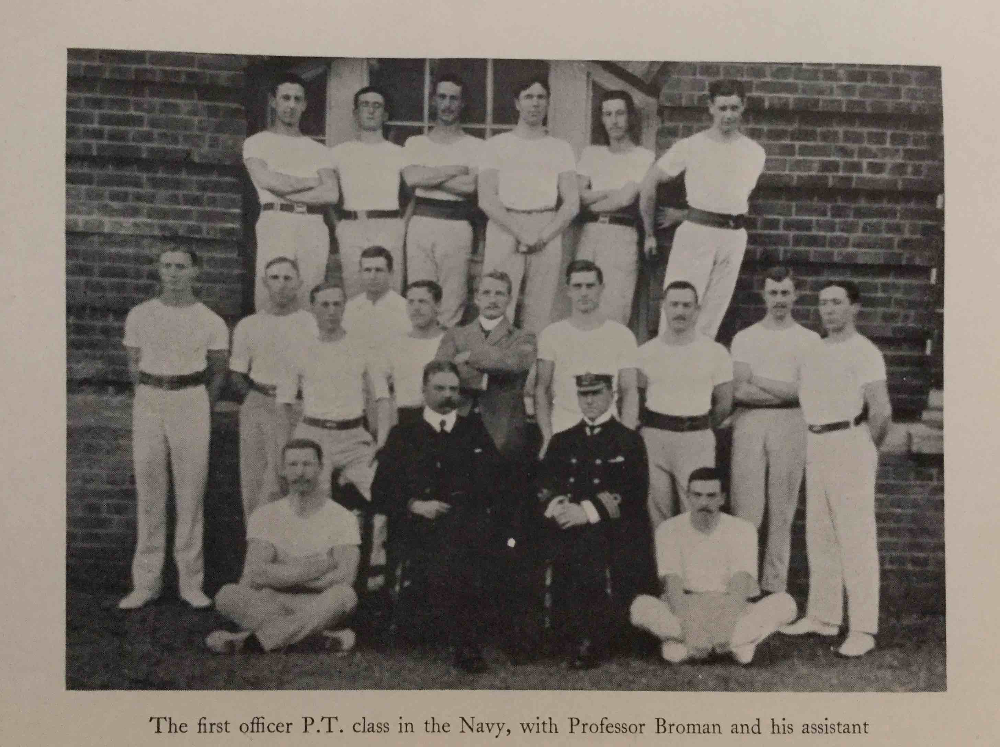

#CHAPTER VI

####I BECOME A PHYSICAL TRAINING EXPERT

Becoming a physical training expert, in the early days of such people in the service, subjected one to much chaff from all sides, we were dubbed acrobats, ju-ju men, strong men, or any name which the wit of the individual seemed to think appropriate. To tell any one who has not been through the course, or studied the subject, that there was a great deal in it was, and is still, a waste of breath. Having once learnt and observed the too-often deplorable effects of so called physical drill carried out in most schools and colleges, and the great shortage of even semi-skilled instructors throughout the country, the Admiralty must be congratulated in so early seeing, what only now the nation is beginning to see, that organized physical training is essential in these mechanized days, and wholesale gravitation of the population to the towns and sedentary occupations.

We four of us, who had been serving abroad, joined up with four other lieutenants, who had already started, having been more immediately available. We were attached at first to the Grenadier Guards, a rather difficult mess to join as they had just been through some sort of trouble, which the Press had got hold of, the Colonel had recently been relieved and a good many of the subalterns were more or less under a cloud, it was some sort of ragging business which seemed very trivial to us sailors but had been made a serious business by publicity.

They were all, of course, very nice to us, as honorary members of the mess. It was not long, however, before the regiment had to go off on manoeuvres and we into diggings in Farnborough.

The course itself was very strenuous, conducted by Sergeant-Major Betts and a group of staff sergeants, all first-class gymnasts of the old school. The effect on most of my colleagues was a severe attack of muscular rheumatism; after a morning spent on the horizontal bar (we used to hang like a row of carcases in a butcher's shop, listening to the monotonous order: “To the breast, pull, lower; pull, lower; pull,” until there wasn't any pull left). However, as we got fitter it was easier, and at the end of the nine months we were really what we thought and, our instructors told us, properly tuned up and trained.

Having done that course, we were sent to Portsmouth to undergo a Swedish course under Professor Broman, a Swedish expert. The first thing we were taught was that all the stuff we had learnt at Aldershot was entirely wrong, and in fact we were quite remarkable to be still alive, we should have strained hearts, lungs, etc. and be more or less sure of being permanent invalids before long.

Every one now knows something of the Swedish theory, and after six months of it we also definitely realized that it was years ahead of the old English system. We were asked to say which system was appropriate for the navy and the verdict was unanimous for the Swedish system as against the army system. One knows positively now that every boy and girl should go through a three months’ Course, about the age of sixteen to twenty, and that such a course could not fail to make a difference to the nation as a whole and to the health and happiness of every individual.

The course completed, we were told off for different jobs—I to Dartmouth to instruct the cadets in the *Britannia*. Once more in the old *Britammia* I quickly found myself hard up against rooted prejudice against this mountebank business, as the commander called it. His greeting was not exactly cordial. “What do you suppose you are going to do here; I can tell you there is no time for this newfangled business, and the cadets have a full day as it is.”

I fear I was a little short at such a reception and explained that I had not asked to come. In fact I had asked to be sent to sea and didn't at all relish the idea of a shore job, but I said: “If you would report to the captain that you have no time or use for physical training, perhaps the Admiralty, who after all sent me here, will allow me to leave.”

Everything was made as difficult as possible. I was only allowed to take the cadets to drill altogether, irrespective of age, for ten minutes before breakfast on the main deck, which meant almost in darkness, and with the heads, and almost the shoulders of the taller cadets out of sight between the beams.

There was, of course, in the *Britannia*, a very fine covered-in poop, a splendid place for my purpose, but when I made the proposition, I was told the captain would not hear of it. The poop was incidently adjoining the captain's quarters, and so things went on for a bit until the captain (Cross) one day said to me: “Why don't you use the poop for your work.” And so we progressed.

The commander left and a new one came with completely different ideas and very easy to work with. On moving the cadets to the college, it was decided the old *Britannia* should for the present remain at her moorings in the river, but the *Hindostan*, a teak-built two-decker, used as a sort of annex to the *Britannia* and connected to her by a bridge, should be sent round to Portsmouth, where she was to be used to accommodate boy artificers.

The *Hindostan* had been built many years ago, in India, to the order of the old East India Company, and she did credit to her builders, for she was found on examination to be absolutely sound. I was put in charge of the operation of getting her round to Portsmouth, and we left Dartmouth in charge of four tugs, amid much lamentation from the good people of Dartmouth and Kingswear who crowded on both sides of the river to give a send-off to a ship that had been so long a feature in the river. All went well, until we were near the Isle of Wight, when a strongish wind got up, and a nasty sea. The ship, in spite of being ballasted down, and the sleeping-deck ports boarded up, still held a good deal of wind and the tugs had considerable difficulty in managing her.

On the top deck had been built a corrugated-iron structure, which did duty as the church for cadets. Some discussion had taken place before sailing as to whether it would be safer to dismantle the church, but it was decided to go round with it in place. As the sea rose the ship rolled—rather heavily and the church visibly moved as she rolled, but there was nothing to be done. It was far too big a building to shore up or secure with ropes, and it seemed more than likely we should have to enter in the log: “Lost overboard by accident, one church, organ, pews, and incidentals complete.” More tugs, however, arrived and eventually we were towed triumphantly up harbour and safely moored. I stayed two years in the *Britannia* as physical training instructor, also taking a term through, which kept me quite busy, and during the last year I also had the superintending of the building of the new gymnasium and swimming bath for the almost completed college. The time came when the last term in the old *Britannia* was drawing to an end. All the old staff were to go to sea except the captain, Goodenough, who had recently joined, and the commander, Brand, also a recent arrival. I had presumed I was to go to sea but was told I was to stay for another year in the college. I was sorry at the time, but glad now, that I saw both the end of the old ship and the beginning of the new régime. From my departmental point of view, of course, the gain was very great. Here we had a properly fitted gym, we could use the cricket fields in summer, and we had at last a properly organized schedule in which my classes came in turn as for any other of the various studies. That the organization and general institution of physical training in a school curriculum is worth while will, I think, be borne out by any visitor, however unobservant, who watches the movements and bearing of the cadets on parade at any morning divisions or public occasion. If any one interested compares these boys with boys of the same age at any public school, I think they are bound to acknowledge the worth of this sphere of training. That every school in England will eventually have to accept it as a necessity, seems definite in the near future. Trained instructors of the right type will be the ruling factor. Even in the navy the supply is not too plentiful, but the standard is on the whole kept high.
