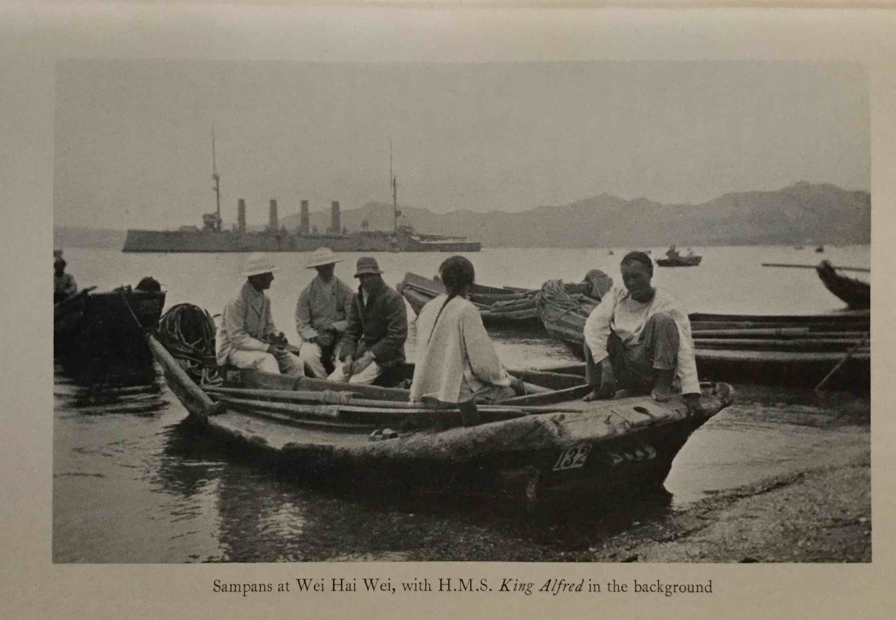

#CHAPTER VII

####CHINA AGAIN

Towards the end of my time at Dartmouth, I had a letter from Consett, about to commission the *King Alfred* as commander, that ship being designated as the new flagship in China, flying the flag of Sir Arthur Moore.

The essence of the letter was to ask if I would like to come to the ship, as Sir Arthur had mentioned my name as suitable. I was delighted, but Goodenough, then captain at Dartmouth, said no, I must finish my term of cadets who had one more term to go. Sir Arthur very kindly said he would arrange to have the appointment kept open and I was to join up as soon as I was set free from Dartmouth.

Nothing more happened until the inspection by the Second Sea Lord at the end of the final term; towards the end of the inspection he was asking me something about my successor and finished up by saying: “You will enjoy serving with Admiral Curzon Howe in the Channel Fleet.”

Here was a little difficulty. I had no idea how much the Second Sea Lord, Admiral Drury, knew about the China proposal, and I felt I was on dangerous ground in preferring to go elsewhere than with Admiral Curzon Howe. I told Cpatian Goodenough what had been said and he undertook to straighten things out and in time I received my appointment to China.

The irony of it was that I went on leave, went to a dance in London rather protesting, as I didn't know my hostess, met and shortly after became engaged to my future wife. There I was, having voluntarily given up three years' Channel groping with its definite periods of leave in exchange for three years in China with no leave.

Once more a P. &. O. voyage to China, this time in the *Sumatra*, not a very good specimen of that famous line. On joining the *King Alfred* at Hong Kong I found the news of my engagement had preceded me and I was greeted by Consett with the information that he had no use for engaged or married men. However, as I could tell him there seemed no chance of my being married that commission, peace was restored and we became the best of friends. Incidentally he himself became a victim not long afterwards. Consett as an executive officer of a big ship was in the very first rank: lots of brains and energy, everything was most efficiently organized, and nothing was done by the ship that was not done well. She led the navy in gunnery practices each year, at regattas, both pulling and sailing, or in the more irksome job of coaling ship; we were continually piling up records. And coaling ship was no small business in the *King Alfred*, about a thousand tons a month had to be got out of a collier or from lighters and stowed in the bunkers and these bunkers seemed to have been specially constructed to make easy stowing out of the question. The *King Alfred* was definitely a very happy ship with first-class officers and a splendid ship's company. Sir Arthur Moore, whose flag we flew, was my old captain in the *Dreadnought*, a man with the highest reputation in the service and in diplomatic circles. A charming host with a sufficiently lively temper to keep every one on their toes. Thursby, the flag captain, was also well known in the service. Among others who have since made their mark, were Tovey, Gordon Campbell, Curteis, Danckwerts; also in the admiral's office was Ricci, well known later on as Bartimeus.

I had been a little more than three years away from China, it was now 1906, and the Russo-Japanese War had recently come to an end with the Battle of Tushima, which had made a great stir in the world and marked a page in Japanese history—by this victory she took her place as a Naval Power. A Treaty had also come into being between England and Japan and British ships were made much of in Japanese ports.

In China the aftermath of the Boxer troubles had subsided. The Dowager Empress once more held her court in Peking. The Manchu dynasty had only begun to be troubled by that persistent and really remarkable man Sun Yat Sen, who almost singlehanded and in spite of repeated failures and hairbreadth escapes with his life, one of these having a setting in our own London, succeeded in overthrowing the Manchu, and restoring China to the Chinese. Whether this sudden and violent overthrow of a long-established government with its roots in the teachings of Confucius, and without anything practical to take its place, has really brought improvement in the lot of the people may be doubtful. Yet in 1930 China was moving; it looked as if after twenty years of civil wars and lack of government tangible good was in sight. Unfortunately other people also became aware that China was stirring and the sight was not one they wished to see.

But from 1906 to 1911, when the overthrow of the Manchus took place, the Far East was prosperous and happy, and from the foreigner's point of view there was peace and safety. Boycots, kidnapping, bandits, words familiar to the everyday life of the foreigner ten years later, were almost unheard of.

Sir Arthur Moore was keenly interested and made an extensive survey of Far Eastern questions of that day, and we visited innumerable ports from Penang through Java, Sumatra, Borneo, Siam, Indo-China, across to the Philippines, away to the north to Vladivostok and Siberian ports beyond, as well as a cruise right round the Japanese Islands both north and south, putting into little bays and harbours which were as yet untouched by Western penetration. Siberian waters were still studded with mines left over from the Russo-Japanese War. We had on board a very charming Russian officer as a pilot for the minefields; he was a good pilot in Vladivostok, a curious city which appeared to be quite dead all day but late at night it certainly woke up to some purpose. The streets were full of droskys, three horses abreast with jingling bells, and containing smartly dressed officers and their ladies off to some ball or opera. We were entertained royally, the dinners, dances and opera were all on a magnificent scale. I believe I saw my first cinema show at Vladivostok, and it was a performance certainly worthy of the label “For adults only”.

Two hundred miles or so north of Vladivostok, in an uninhabited bay at the mouth of a river, we happened to witness the arrival on the coast of a trek of pioneers from Russia—men, women and children, perhaps three or four hundred of them. Primitive-looking people in huge tented wagons not unlike the wagons used by the Boers in South Africa, but drawn by teams of horses instead of oxen, they had been on the road many months and were now going to settle down and farm the land. Certainly they had chosen a beautiful stretch of country, with a river teeming with salmon and abundance of fish in the bay. All this coast of Siberia is in fact splendid-looking country in summer with a delightful climate but there is the all-too-long winter.

I had at that time a small sampan which I carried about in the ship. It sailed fairly well and her very shallow draught was most useful for exploring rivers and creeks on fishing and shooting expeditions. In China, as elsewhere, there are apt to be sudden breaks in the weather. I had necessarily some rather close calls in regaining the ship usually anchored a mile or more off shore.

One I remember at Port Lazareff in Corea, now I believe a quite important Japanese naval base. But Japan had not yet arrived in those days, it was just a very fine land-locked harbour with a tiny Corean village at the mouth of the river flowing into it. Round the estuary of the river, which in fact had several mouths, there were extensive marshes, the haunt of snipe and wild fowl of all descriptions.

We left the ship before dawn in the sampan, three of us and my messenger boy who had become a quite useful boatman; not too nice a morning, but no indication on the barometer of what was to come. I knew the country a little, at least I had been there before. We sailed up one leg of the river, about three miles, and landed at daylight to shoot across a peninsula which lay between two streams of the river. I sent the boy off with the sampan; he was to sail down the way we had come and sail up the other leg where he was to meet us. We had not long parted with the boat before the first squall struck us, accompanied by sheets of rain. We plodded on and as far as shooting went there was nothing to complain of, but I was anxious about the boat. It also dawned on us after a bit that the water in the marsh was rising, that there was no high ground almost as far as you could see, and that what dry ground there still was in the marsh was alive with land crabs, nasty-looking brutes which scuttle along at a great pace, with their oversize claws waving in the air. Some one shot a duck which we were some few minutes before picking up; it was already the centre of interest to an army of land crabs and we perhaps realized there would not be much left of any one who got lost or disabled in those marshes.

With this pleasing thought anxiety to meet the sampan became more acute. The wind continued to rise till it was blowing a gale and forcing the tall reeds down nearly horizontal; it was difficult to get about. We got to the edge of the river, our rendezvous, with the water well above our ankles. How much would it continue to rise and what were the odds for us hitting off the sampan or of the boy being able to manage her at all in this weather? Looking back over the marsh there seemed no single spot a foot higher than any other, while moving about there was a good chance of going up to your neck in a mud-hole, so there was nothing for it but to crouch in the reeds on the very edge of the river and hope we should be seen. Nobody said much but I expect our thoughts were much the same, when we sighted the boat coming up river at a great pace, the wind behind her and my gallant messenger lad sitting in the sternsheets soaked to the skin and hanging on to the sheet like grim death, apparently thoroughly enjoying himself, taking it all as part and parcel of the day's outing. I wonder if he had missed us how far he would have gone into Corea; it would have been difficult single-handed to do anything but run before it. However, there we were, wet through and pretty cold but with a boat under us instead of oozing mud. Our troubles weren't quite over; we were evidently getting the tail end of a typhoon, the wind was blowing straight up river and we had to beat out and then to the ship. The latter was, however, in a safe anchorage and there was no danger of her having to put to sea. Many hours we spent beating out of that river and then pulling when we got to the broken water on the bar. It was good to see, just before dark, the picket boat ploughing her way towards us and realize we had been seen.

Early in 1907 after, as may be supposed, a good deal of correspondence on the subject, my future wife's mother agreed to bring her out to China to enable us to get married. Getting married in the navy, although so popular, is not at all easy when it comes to practical details. Having squared some kind-hearted lady into taking the principal part, for choice one who knows nothing of what she is in for, or she might not face up to it, you then begin to arrange how and where you are going to meet. In my case the first place arranged for was Hong Kong, and I flattered myself the arrangements there were pretty good; the usual change in programme necessitated the squadron sailing a few days before the all-important P. &. O. arrived. Again I arranged, or thought I had, for the ceremony to take place in Yokohama—a complicated business being married in Japan, so many authorities seem to want to take a hand. The British Embassy had to take a hand, the British Consul, the Mayor of the town, and I don't know who else. Having done all this the fleet was ordered to Kobé; this time it looked as if we should pass each other on the high seas. I got leave to go round to Kobé by train and intercept my lady. The day I was due to leave we had a match against the Yokohama Rowing Club in fours; I was pulling stroke oar and there was no one else at that time in the ship with practice in sliding seats; it was a close thing but we won the race and I into a ricksha for the station where a very worried marine servant was waiting with my kit. That night in the train I went into the restaurant car for dinner, taking a vacant seat opposite a man who said: “You don't remember me”—it was my German travelling companion of my journey home across America from the Albion. He asked me what I was doing, and having told him I was just going round to Kobé to get married, he asked me where we thought of going after that exciting event, and gave me a list of hotels of which he was apparently interested, telling me to show his card, on which he had written something unintelligible to me in Japanese.

In due course the wedding took place from the Oriental Hotel, Kobé. I think there were four ladies present, wives of officers in the fleet, and about two hundred officers. We went off to Kyoto expecting to be completely unknown. To our horror we were met by a deputation of some sort and put into an old-fashioned barouche with two white horses. I should imagine the only thing of its kind in Kyoto if not in Japan. In front of us ran a man with a long white wand clearing the way through crowded streets and repeating a sort of chant which I supposed was to tell the world of Kyoto we were newly married.

At the Myako Hotel more deputations and all the foreign visitors in the place. We stayed at Kyoto a week or so and if any one has been in that city, or seen that country in May when the hills are covered in pink azaleas, with flowers everywhere, will realize it is a suitable place for a honeymoon. As our stay drew near an end, I asked for the account and after perusing a closely written sheet of foolscap remarked to my wife that it looked as if we should be married about a month and after that broke to the world, and that is where my German friend came in. I casually showed the card he had given me to the proprietor; the oracle worked beyond my expectations. Without a word he took the formidable bill from my hands and said I must pay what I wished. I named a figure at so much a day which appeared reasonable and he accepted without comment; and so it was elsewhere.

I have never met or heard of my travelling friend again and I suppose we fought on opposite sides in the War, but I am always indebted to him for a handsome wedding present.

We spent most of our time in Japan, at Kyoto and Myanoshita, from whence we made daily expeditions on ponies. On our return journey through Shanghai we were the guests of Arthur Gresson, then Taipan of Jardines, and so back to Wei Hai to rejoin the ship.

In January 1909 we paid off and recommissioned at Hong Kong. I had been given the option of going home or staying on as first lieutenant. I wanted to go home, my wife had already gone, but the chance was too good to miss. I had only recently got my half stripe and to be first lieutenant of the flagship in China at that seniority was an exceptional offer which I naturally jumped at. Sir Hedworth Lambton, the new C.-in-C., and his staff were not due for a month or two. The commander and several other officers were staying on, some of them recent arrivals, some who had already done the whole commission.

Shortly after commissioning we left for Singapore and Consett, the commander, developed an appendix, was operated on in Singapore Hospital and eventually invalided home. Incidentally, he who could be so cutting about the uselessness of married men in a ship, fell himself a victim and met his fate in the P. &. O. on the way home.

I became acting commander until such time as the new man was appointed and could reach China. Lewis eventually joined with the new admiral and his staff and we said good-bye to Sir Arthur Moore.

We settled down to the new commission and it proved no less interesting and successful than the first. Sir Hedworth entertained lavishly and to cope with his bigger parties, with the help of the ship's carpenter, a horse-shoe shaped table was designed that went right round the afterpart of the quarter deck. I think we could seat Seventy. The table was made with a wooden framework on which sheets of plate glass were laid. At night we ran an electric circuit under the table with pink tinted bulbs, which showed through the glass and tablecloth and produced a light which the ladies voted most becoming. Listening to the wireless recently, I heard Gordon Campbell talking about this table and how the lights underneath attracted the mosquitoes and caused excessive scratching of legs. That's as it may be, I do not remember any one complaining of leg-scratching at the time.

Hedworth Lambton had caused to be made a red and white striped awning, to go under the main canvas awning - quite a familiar sight now, but was certainly the first seen out in the East. He also had a very fine collection of plate with the Ascot Gold Cup for a centre-piece. The whole business, laid out and lit up, looked well.

Many distinguished visitors fed at that table. Amongst others, the King and Queen of Siam, the Crown Prince and Princess of Japan, ambassadors and governors galore. As our second commission drew to a close, in February 1911, so the disturbed condition in China came to a climax. Sun Yat Sen achieved at last the fulfilment of his work. The Dowager Empress was dethroned and the power of the Manchus broken. I had spent nearly four years this time in China. I had acquired a good deal of first-hand knowledge of the relative position of China and Japan, the Japanese and Americans, the French and Dutch in the south, and our own position *vis-à-vis* all other countries having Far Eastern interests. I had seen Shanghai with almost the appearance of a small country town in *Albion* days (I am talking of the British, now International, Settlement) raised to a city with up-to-date hotels and clubs, and with a huge river scheme in progress which was to allow big ships to enter the Whang Pao River. I had seen changes in Hong Kong, Canton, Saigon and Batavia. Only Nanking still remained outwardly the same but with already a railway growing out from Shanghai, and the marshes being drained and got ready at Pukow, on the opposite bank, to commence a railway to Peking.

All this knowledge acquired under the ideal conditions which service in the navy provides, was of the greatest use to me later on, under again very different conditions, but with the same framework, for the picture.

