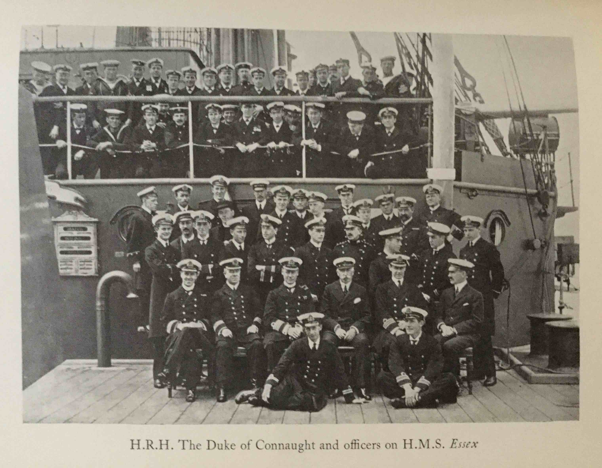

#CHAPTER IX

####H.M.S. *ESSEX*

And so it was in December 1913 we commissioned the *Essex* at Plymouth, the ship had been undergoing a long refit, and afterwards laid up in dockyard, care and maintenance.

To the uninitiated, a long refit would possibly mean a ship turned out as good as new.

Actually it means a ship in which every possible thing has been pulled to pieces and put together again and left in an indescribably dirty condition. As commander, I went to live on board a few days before commissioning, what time the gallant dockyard matey was slapping on paint over the dirt just presumably to make certain we should take it away with us. It was possible by dubious means to save a little of the taxpayers' money, by accepting compartments as painted out and securing the paint, by such means it would be possible to clean down first before painting, so avoiding the usual business of having to scrape off the layers of paint as well as the dirt. Why these things are done is always something of a mystery, inextricably bound up with trade union regulations. Any way the *Essex* was no better or worse than any other ship coming out of a long spell in dockyard hands; she was filthy and the job of getting her clean looked hopeless. Along came our batch of boys, they certainly looked small and not very encouraging.

Having told them off and put them on the watch bill, we had to start in “Provision ship”, “Ammunition ship”, “Tilt test”, and all the many details which have to be gone through before a man-of-war is ready for sea.

The boys from the first, were tremendously keen and certainly there was a surprising year of experience ahead of them. In due course, on Friday the 13th of January 1914 we sailed, an unpropitious date for the superstitious. We pushed straight into a good hard blow, the very best thing that could have happened, if a little expensive; the boys soon got their sea legs but not so soon learnt to look after their mess gear.

Arriving eventually at Madeira there was very little crockery of any sort left on the mess decks, and in consequence a good deal of discomfort, but the lesson was learnt.

Incidentally this ship was, I believe, the first to carry out general messing, more or less brought about by the fact that there was no one in the messes with sufficient knowledge or experience to take cook of the mess.

One of the first difficulties we came up against was in the matter of clothes. A seaman, as he goes on, collects clothes against a rainy day; a boy has a bare outfit. We coaled ship in the rain at Plymouth and we had been wet more or less ever since. We couldn't wash or dry clothes quick enough, and here we were at Madeira, a long swell running, and another six hundred tons of coal to come in. Coaling at Madeira was often enough lively work with the short coallighters in use, bobbing about like corks alongside. More experience! We coaled well into the night; a day or two to clean ship, and get some much-needed boat drill, and away to Jamaica. Here we were more or less in clover, the coaling contract included labour to put on board and all we had to do was to strike it down. I had put my shoulder out on the way across—a trick I had—and sometimes it was worse than other times; this was a bad one, and needed chloroform to get it back, and a longish spell in a sling. However, thanks to kind friends, among whom was one of my former cadet term now turned soldier, I managed to get a good deal of riding in that delightful island before we sailed again for Vera Cruz, Mexico, where we were to hoist the admiral's flag. Hoisting an admiral's flag when not organized as a flagship is no doubt a great honour but does entail a certain amount of domestic upheaval. The captain has to make way for the admiral, the commander for the captain, and so on down the scale, a general post of cabins. That little difficulty over, in due course Sir Christopher Cradock came on board. The *Suffolk*, Captain Phillip Franklin, sailed for Jamaica and we started our sojourn in Mexican waters by taking in about a thousand tons of coal. This was the first time I had seen the coal-dredger at work—more or less on the same principle as an ordinary dredger but discharging into a loose leather hose like a huge elephant's trunk the end of which emptied on deck.

The coal was dusty and with the usual nor’-easter blowing it was about the dirtiest method of coaling I remember.

At Vera Cruz we found a somewhat tense situation, there was active warfare between two factions in Mexico. President Madero had been shot the year before and Huerta reigned in his stead—he, it seems, having arranged for the decease of his predecessor.

The Government of President Huerta was by report a good one, always of course by comparison, and the country was said to be progressing. The United States had, however, refused to recognize him. The British Government had taken the opposite view; a difference of opinion between two powers, who in the best interests of the world should see eye to eye. It appeared, or at least the story was told in Vera Cruz, that Madame Madero was some sort of relation of Mrs. Woodrow Wilson and that after her husband's assassination she had fled to the White House and the President had said “I will never recognize your husband's murderer.” The Mexican parties in opposition to Huerta were led by Caranza and General Villa, the latter described as little more than a bandit; but he received support as time went on from the American Government. As things went, Americans in Mexico were having a bad time, some were killed and others maltreated. Sailors from the American Fleet were landed in Vera Cruz and took possession of the town, not without opposition; there was fighting in the streets, a good many Mexicans were killed and some Americans. The stoutest opposition came from the Naval College which faced the main square across which the American landing party had to advance. The cadets lined the dormitory windows and kept up a heavy rifle fire, until an American cruiser lying alongside us opened fire with her ship's guns, and the college was soon evacuated. The fighting went on for some days and at night odd snipers used to fire at the ships and we got as much attention as any one for to the sniper a ship was a ship and nationality no matter.

One gentleman in particular we nicknamed Cuthbert, why Cuthbert I don't know, but Cuthbert was rather a nuisance; he got himself down somewhere under the long wooden jetty opposite the ship, perhaps seventy or eighty yards distant. The ship was moored with stern towards the pier so the quarter deck got the most attention. It was very hot and everything that could be open was open; but as soon as the lights went on in the evening Cuthbert would commence and he made pretty good shooting, there was soon a pattern on the bulkhead at the fore end of the quarter deck. The admiral, delightful as he was, was slightly irritable at that time. It was very hot, he had been at Vera Cruz nearly a year, and it seemed he might be there a good deal longer. He was annoyed with Cuthbert, but we were strictly neutral. If a complaint was made to the American admiral the latter would at once say please anchor outside harbour, you will then be quite safe. They badly wanted the bouy we were at, and Cradock had no intention of being turned out by Cuthbert, he was much too interested in watching the proceedings, which were indeed most interesting.

The admiral's line of action was to ignore Cuthbert, to take no notice, and to prevail on every one that it was not a subject of interest. In the admiral's cabin was the usual 12-pounder gun-port, wide open towards the lair of Cuthbert. H. D. R. Watson, the captain, usually sat at meals with his back to the gun-port, presenting under the light, with a white mess jacket, only too good a target for Cuthbert. Watson very naturally objected when he heard the smack of a bullet on the ship's side, and asked to have the gun-ports closed. However, the admiral scouted the idea that there was any danger. It was not until a bullet came through the gun-port and smashed an electric-light fitting in the cabin, that the ports were at last allowed to be closed.

Another difficulty was the band. Cradock liked the band to play on the port side of the quarter deck, as he heard better down in the cabin. But the port side was that nearest to Cuthbert and in spite of orders, as the band came aft, the music stands would be set up on the starboard side well behind the turret.

One night I was sent for and asked why the band was playing on the starboard side. I murmured something about it being very hot, and there was a little more air, and so on. Going on deck I was standing talking to the paymaster on the port side when *ping* went a bullet smack against the turret. The paymaster shot up into the air and clapped his hands to his mouth. I thought he had been shot in the mouth and said, “That's all right, old chap, keep your mouth shut and we'll soon get the doctor,” and I half carried him down to his cabin, when as I lifted him on to his bunk I saw his legs were smothered in blood. The bullet had actually passed through both legs and luckily for him, entirely missed the bone, but he had a nasty shock, and that episode entirely finished the band.

A few days later the admiral sent for me and said: “It is some time since I heard anything from Mexico City and I'm worried about the minister and the legation. The retreating Mexicans have torn up the railway line and the telegraph and telephone, and there is no communication. I want you to get through, you will take a dispatch, see how they all are, and get back as soon as you can as I want to go to Tampico, where there is more trouble, you had better ride and I have arranged to buy the best horse in Vera Cruz for you. Work out a plan and let me know when you can start, I should like you to get away to-night if possible.”

I went ashore to make inquiries of the British Vice-Consul who was incidentally at that time a German. After discussing ways and means, Mexico City is about six hundred miles from the coast, he said: “I understand you are going to ride out and on a certain horse.” I said: “Yes, the admiral tells me he is the best horse to be had.” “Yes,” he replied, “and every one in the neighbourhood knows the horse, the jails have all been thrown open and most of the inmates were there for horse stealing.” It seemed to me there was a good deal in this and after seeing the American authorities about details, I returned on board and reported to the admiral that the necessary arrangements were made, but if he did not mind I would walk to start with and see how I got on.

The admiral was furious, and although I told him what the Consul had said, which seemed quite sound, he would not hear any more, saying: “I suppose you are afraid to go, I don’t blame you, I shall have to go myself.” Naturally I went away thinking I had made an ass of myself and wishing sincerely I had never said anything about the horse. However, about six o'clock, I was sent for again and told rather curtly I could do what I liked, but he wanted me to go. After I had left on my expedition the admiral sent a case of champagne into the wardroom to drink my health and wish me good luck.

There had been some discussion whether I should go armed or unarmed and I elected to do the latter, which was just as well as I was searched more than once and in any case it was useless to resist except possibly a stray robber.

I took with me one petty officer and one gunner of the Royal Marine Artillery. One carried a Union Jack and the other a white flag, and between them a suitcase as I had to have a blue uniform. We were going from very hot to pretty cool, 6,000 feet up, and part of my orders were, if possible, to see the president.

The Americans gave us an engine and carriage and ran us out to their outpost line. Some five or six miles out and just as dawn was breaking, we started off, after shaking hands solemnly with a large number of American officers, who seemed to think I was doing something rather daft.

Besides my escort of two, I had an interpreter with me, a Mexican who went by the name of Franco. Franco was terrified of the Americans, possibly with good reason. However, he at least was pleased when we had left the American outpost behind and were walking down the railway track.

It was still dark and the track was outlined away across the plain with burning railway sleepers; the permanent way was itself undamaged.

We hadn't gone far before the sun came up in a burst and gave us a hint of what we were in for.

Three or four miles, perhaps a little more, one became aware in the distance that soldiers were running and apparently taking up positions each side of the line. Through glasses I could see they were assuming what is called, in the gunnery school, the prone position and they were undoubtedly drawing a bead on us. Franco did not think they would fire when they saw what a small party we were and I sincerely hoped he was right. There was nothing for it but to walk straight on with the jack and the white flag carried as conspicuously as possible.

It was a relief when, as we got closer, an individual obviously with authority came out of the scrub and having stood in the open for a minute gave an order and our friends stood up. On approaching, the officer who was not wearing any sort of uniform, said they had thought it was the American flag approaching. Franco explained who we were and at the same time found out under which leader this particular Party were. This was very necessary as I had passports of sorts in my pocket for use with either party and it was just as well to bring out the right one. After a short explanation of my reasons for wishing to go to Mexico City we passed on our way. I knew a General Maas was in command of this district. He had been on board the *Essex*, to see the admiral before the American landing, and I learned he was now at Soledad and also that from Soledad the railway was still intact.

We walked for another hour or two and were then stopped by a troop of Rurales, mounted militia or yeomanry as we should call them. This party galloped up in a cloud of dust, picturesque chaps; the same sort of palaver took place and as we parted there were cries of “Viva Inglesi.”

Eventually, some time in the afternoon, we arrived at Soledad where we had at first a not too pleasant reception, the crowd streaming out shouting “à bas les gringoes”. Franco could not at first make himself heard and seemed just a little scared, but when the crowd took it in we were English there was a change of front and amid *vivas* we were hustled along to General Maas's headquarters.

The term gringoes by which Americans were known at that time comes, I believe, from a former invasion of Mexico, when the Americans had a marching song which began “Green grows the grass where we come from". “Green grows" became gringoes used derisively. For some reason it seemed to be assumed the British were on the side of Mexico. Actually, of course, we were strictly neutral but the British Government had recognized Huertas's Government and the American Government had not. It seems also that Englishmen have at some time earned a high reputation in Mexico, for to this day they say, when clinching a bargain "Palaver Inglesi” or “on the word of an Englishman”. 

The American Government had, I think, made a mistake in aiding and abetting Villa. This was the opinion held not only by British subjects but universally by Americans living in the country.

However that may be, in Federal country Americans were in great danger, while an Englishman was something of a hero and only in danger should he be taken for American, which was likely enough to happen.

Arrived at General Maas’s headquarters my first feeling was one of relief at having got out of the sun for a bit. The General was friendly but inquisitive as to what force was in Vera Cruz and were the Americans going to advance and so on; as I had no sort of knowledge of the American plans I was able to say with a clear conscience that I knew nothing, I was merely carrying despatches and finding out for Admiral Cradock the state of British affairs in Mexico City and in no way concerned with anything else.

After a short delay, General Maas gave me an engine and a cattle truck with many apologies that he had no other rolling stock available, he hoped however by sending me on now I should pick up a passenger train somewhere farther on.

I had been to Mexico City before and as any one will agree the scenery from Orizaba up through the mountains over impossible-looking bridges which span the gorges is very beautiful, and lost nothing from being observed from the back of the truck. My escort slept while I sat on the floor with two Mexican soldiers dangling our legs over the back; it was too good to be missed. Night fell and all slept except, I hope, the driver.

Somewhere about midnight we made our connection and transferred to a first-class coach and after a comfortable day arrived at daylight the following morning. It was very cold but I knew my way to the legation and we were glad enough to walk.

Arriving at the legation, still very early, I was greeted first by Tom Hohler, then first secretary to the minister, Sir Lionel Carden. They were very surprised to see me, having of course had no news of my leaving Vera Cruz, or if it was possible to get through. As soon as possible it was arranged for me to go with the minister to interview the president.

Arrived at the palace we passed up the stairs, on each landing stood two soldiers with drawn swords and again in front of the sort of ballroom into which we were shown. We waited some time, time to examine the room which was a very fine one in French style. While examining a portrait of, I think, Napoleon, I became aware of an individual in the middle of the room. I longed to ask him how he got there, for I don't know now, I had neither seen nor heard a door open or any move. It was Blanquet, the Minister for War, and incidentally the man who rumour had it had actually despatched Madero. He came to explain that the president was unable to see us but that he was acting for him in all ways. The position in the city had for Americans become dangerous; Sir Lionel was anxious that I should escort them down to the coast, I heard that their own minister had been already withdrawn; they themselves were doubtful if it was not wiser to stay in the city rather than face the journey. Sir Lionel was to try and get some sort of safe conduct for them and Blanquet agreed they should go. I was very much against taking them down the way I had come as I knew the strength of the feeling that existed in the district through which I had passed on the way up. The railway was torn up beyond Soledad and this meant a long and arduous march in great heat and everything in the way of baggage would have to be carried. I proposed that they should go south to Puerto Mexico, a longer but safer route; the country through which they would pass was tranquil and the train would land them right down at the ship.

This plan was agreed to; I was myself to go back the way I had come which would give me time to inform the admiral what had been done and for him to send a ship to meet the refugees. Blanquet had promised the Americans should go and that two trains should be ready for them the next morning. Back to the legation and another meeting of leading Americans. They did not like the plan but wanted apparently to go with me to Vera Cruz. It all had to be explained again and a compromise was affected by agreeing that each train should fly the Union Jack and be in charge of a British subject responsible for the general safety.

Volunteers to take the trains were soon forthcoming from among the English residents. No sooner, however, did everything appear to be settled than a message came to inform the minister that the president was not prepared to let any more American subjects leave. Back to the palace again and more palaver; once more permission was given but definitely they were to go to Puerto Mexico.

Armed with despatches from all the legations in the city I got to the station ready for my return journey about 10 p.m., having had a pretty long day.

At the station I found a guard from the president's bodyguard and the officer in charge informed me his orders were to travel with me to Vera Cruz. This arrangement upset Franco a good deal; he said it meant we were likely to fall in with Villa people, he didn't think we should get beyond Oriziba where we could get horses and made a detour to the south.

Off we went in the greatest comfort and the officer of the guard spoke good English and proved an interesting travelling companion, but it was to be a disturbed night. At Esperanza we fell in with General Maas's army entrained and evidently *en route* for the city. Lines of trains loaded with men, horses, and guns all waiting on sidings. Later, at Matia, I met General Maas himself; he was at some pains to tell me he was now making this place his headquarters instead of Soledad; it was pretty evident the Federals were in retreat but how far the Villarists had advanced was the problem. Señor Franco was definitely gloomy, he had heard from the army the bridges had been mined and would go up with the first train that passed. The officer commanding the guard did not however seem unduly disturbed; he said he thought we should get through as there was still an outpost at Soledad. All went well and we arrived at Soledad about eight o'clock in the morning. We found on the station Platform 106 refugee Americans from the Cordoba district. They were in a bad state having been on the platform since the previous day. In Cordoba they had been in prison some days there were a good many women and children and it was already getting very hot. As the train came in they implored me to get them released. Of course I reassured them and said certainly you shall come on with me although I was not quite certain how it was going to be done.

The officer of the guard was very helpful, but the local commander said he could not let them go, his orders were that no more Americans were to leave. I got him to send a personal message through from me to General Maas and in half an hour or so, which I fear seemed much longer to some, an answer came back in the affirmative. They soon crowded out the saloon carriage and made short work of the well-stocked restaurant car.

I knew, and the Mexican officer knew, but I did not make it public that we could only go a short way; it was something to get them off the station platform and away from a somewhat hostile crowd. When the train came to a stop I had to make a little speech and explain what they had before them and how we must try and make the American outposts before dark, but they mustn't straggle, the men must help the women and children and not go on ahead.

Then began an amusing march or procession. No sooner had we all got out on the line, I had said my farewells and thanks to the officer, the train had reversed and gone off, when I was attacked by an elderly lady who explained it was years since she had walked and could not I get her a conveyance of some sort? I had to say there was absolutely no hope and even if she had never walked, now was the time to try. However, she couldn't walk and we had to carry her in a blanket, one man hanging on to each corner. While this business was going through, some of the tougher men had, in spite of my little sermon, legged it on ahead. So I sent Petty Officer Beatty ahead to call a halt and send the four leaders back for blanket duty. If you want real good exercise try carrying a pretty heavy woman, in a blanket, four men, one to each corner, temperature anywhere about 109 degrees and no shade. However, the lady lived through it, which is more than seemed likely at first. Most of the refugees were splendid. I never saw any of them again but I did admire the grit they showed. One or two ladies had been evidently rounded up in their party frocks, which were definitely the worse for wear, but never murmured.

Just as dusk fell we turned them over to the American outposts, and I slipped away to catch a tramcar, and so back to the ship. The *Berwick*, Captain Clinton Baker, was despatched to Puerto Mexico to meet the refugees from the city and we sailed for Tampico.

I received, through the Foreign Office, a charming message of appreciation from President Wilson and letters from individuals all over the world, some of which were quite amusing. Arrived at Tampico we found the triangular duel had reached an intensive stage. An American boat had been fired on and Admiral Mayo, the American admiral, had issued an ultimatum and demanded an apology. At the same time the Villarists were approaching the town, and were already on the banks of the river, where they were being engaged by Federal gunboats.

The usual norther was blowing and the *Essex* had to anchor some distance outside the bar.

Tampico is the centre of the oil industry in Mexico and there were considerable British interests involved.

Admiral Cradock was not at all pleased with the American ultimatum, because of the British interests at stake, and he wished me to go up the river and visit Captain Doughty in the *Hermione* and ascertain exactly how matters stood.

As we should have to pass between the Mexican gunboats and the bank held by the opposition, we were pretty sure to be sniped at, and half a day was spent putting bullet-proof plating along the sides of the picket boat and over the sternsheets.

The boat so adorned was not improved as a sea boat, and it was satisfactory to get into the river and safely over the bar.

The first mile or two of the Tampico River is remarkable for the number of pelicans, these curious birds line the banks right along both sides of the river. Farther from the sea one passes forests of oil tanks and ships loading directly from them. Work was for the time at a standstill and more than one tank had been fired, making a tremendous illumination at night. As we approached Tampico we had to pass the Mexican gunboat *Brava*, banging away with her guns into the scrub from whence came the rattle of musketry. She held her fire as we passed and except for the occasional whistle of a bullet overhead, just enough to keep our heads down, we came to no harm.

The *Hermione* herself was crowded by British subjects from the various oil companies who had come in from the neighbouring country. The mess deck had been evacuated by the bluejackets and was occupied by women and children while many lighters and boats were moored along her lee side, that is the ship's side away from the fighting.

The picket boat left on her return journey in the afternoon, she was to pick me up the next day. I went out to the Federal trenches to see as far as possible what was happening; warfare in Mexico is a curious mixture of tragic and comic. The Federals were holding a line of trenches some three miles out of the town; neither side appeared to have any artillery. At the bottom of the trench in the cool of the late afternoon the women were cooking the chupatties on little charcoal fires. Some few men were lining the trenches and having an occasional shot at the enemy, whose lines were visible about eight hundred yards away across a shallow valley. The road from the town behind us led at right angles through the trenches and across the valley. It was a picturesque setting and except for the occasional crack of a rifle and a dead mule already too long in the sun, there was little to make any one suppose a crisis was at hand, for it was on the following morning the Federals broke and Tampico fell. An episode occurred while we were still up in the trenches which must have been unique even in Mexican warfare.

Along the road from the town came two open carriages, each with four ladies; they stopped on the road and there was much cheering and *vivas*. Then each lady's name was apparently called out in turn. Some one in the trenches would stand up and shout Viva Carmencita or whatever the lady's name was, the lady named stood upon the seat of the carriage and bowed amid more *vivas*; each did this in turn as her name was called, and the little ceremony over the carriages turned and drove back into the town.

The next morning firing just over the hill became intense, and a gun mounted on the rear truck of a long train standing alongside the ship began firing, while the engines of the waiting trains were blowing off steam, the drivers evidently having no intention of being caught. As we watched, the retreating army began to pour down the hillside making a headlong rush for the waiting trains: It was a scene such as a cinema producer might have given much to feature. They climbed on to the trains until there was no more room inside or on the roof; the trains drew out, the gun in the rear truck banging away at the now visible pursuing cavalry, hundreds were running along the track after the trains. As the last train passed over a bridge a few miles up, the bridge was blown up, and almost simultaneously the Federal gunboat *Brava* passed up the river where she was sunk by her crew who joined the retreating army. That was the end of the Government resistance in Tampico.

I returned to the *Essex*, getting on board just in time, for it was blowing hard and only possible to climb in over the stern walk and it was not possible to hoist the boat in. Beside the picket boat, the launch and two cutters were also moored astern, for they had been busy transporting refugees to a merchant ship chartered for the purpose. During my absence the *Suffolk* had arrived and was to rehoist the flag the following morning, while we were to sail for Canadian Waters.

That night we had a farewell dinner on the quarter deck, the last time any of us were to see the Admiral alive, for it was only a few months before the Battle of Coronel.

It was not a very peaceful dinner party. The sea was running high, all the men had been got out of the boats except two men in the picket boat. During dinner the ship began to pitch and I realized there was a chance we should lose the boats during the night. I determined to get the men out and this was successfully accomplished but I had much neglected our guest. When I eventually returned I suppose I looked more cheerful, for the Admiral said “That's better, Commander, I know what it is to sit through a meal when you feel you ought to be elsewhere.” Which was true, of course, not that the officer of the watch was not perfectly capable of doing the job but there is always on such an occasion the risk of smashing the boat or losing a man overboard; if either should happen it's more satisfactory to be doing the job yourself than to blame yourself afterwards for not doing it.

Having transferred the admiral's flag and said good-bye to him and his staff, all so soon to end their lives in the *Good Hope*, we weighed for Bermuda and Quebec.

We still had the problem of getting the boats in. The ship was knocking about a good deal but by steaming slow and using plenty of oil the picket boat was at last hooked on, she got a nasty bash against the funnel and was eventually landed in her cradle. Life had been fairly strenuous in Mexican waters and we were off to Canada and cool weather; it seemed good and it was a happy ship that steamed away.

I have rather concentrated on particular incidents but all the time the training of the boys was going ahead. They had seen and done a lot, providing guards for property and boats for refugees; one party under the gunnery lieutenant had replaced a railway engine on the line, the said engine having been pitched into a ditch and made unserviceable, or so it was reported. We wanted an engine to take some trucks out to bring in refugees. It was put back on the line and the engine-room staff had it quickly repaired and steam up. The boys were shaping well and did I believe exceed every one's expectations even then; they were soon to be put to still more rigorous tests.

We called at Bermuda for coal, spent a few days in that delightful island and as most of the ship's company had no leave since leaving England, shore-going was popular. Coaled and cleaned, we once more stood north and began to think if we had any warm clothes stowed away somewhere. Three days out, and approaching the entrance of the St. Lawrence River, we intercepted messages from the *Empress of Ireland*, she had been in collision with the Norwegian collier *Storstad* and was badly damaged; just time to get her position when wireless ceased. We were some three hours' steaming off. Working up to full speed brought us to the scene of the disaster in the early morning, much too late of course to save life, all we could do was to attend to the dead for she had gone down with practically all hands. The collision had occurred off a little French-Canadian fishing village which had a rough wooden pier. This pier was a gruesome sight as I landed on it at daylight, the corpses as they had been picked out of the water by fishing boats had been put on the pier. Most of them had no clothing, and of course there was no one who could identify any one. There were a number of small children picked up and they looked just as if they were lying asleep, so that one's first instinct was to get something to cover them, they must be so cold.

It was decided to take all the bodies to Quebec. To do so, it was necessary to put them into rough cases for the journey, and it was quite surprising to see boys of the ship going about this gruesome task like veterans.

Arrived at Quebec the next morning, they had the even more gruesome task of laying them out in rows for identification, and as mothers, wives, relations of all sorts trooped into the railway terminus, now transformed into a mortuary, the scenes, as body after body was identified, were trying enough to upset any one.

The next day there was a public funeral, and as we had to supply the band and escort, and as many men as possible to line the streets, I still found there was plenty to do for the commander.

Our somewhat tragic and troubled arrival in Quebec was soon forgotten in the warm welcome and hospitality of Canada. The Governor-General, H.R.H. the Duke of Connaught, was in residence, and we soon had the honour of making his acquaintance and of meeting the Duchess and Princess Patricia, and all their Royal Highness's delightful staff -- Farquhar, Buller, Bulkeley and Boscawan -- all fated to lose their lives in a few months’ time in France.

His Royal Highness was to go on a tour of inspection to the militia camp at Pettawawa, General Sam Hughes in command. H.R.H. thought it would be a good thing to have a naval A.D.C. with his staff. Ramsay, afterwards to marry the Princess, had been acting in this capacity, but had gone home. I was the temporary substitute and a most interesting trip I had.

We lived in the royal train and many interesting people came to have meals with H.R.H. including the Premier, Mr. Borden. Sam Hughes, of course, we saw a lot of, an extraordinary character who amused us all a good deal. General Burstall of the Canadians was also attached to the staff and was one of the few survivors, almost the only one I knew personally, among the officers who went over with Princess Patricia's Own, as they were called. It was hot at Pettawawa, there was a good deal of marching about each day, and it was amusing in the evening to see what we called the grand trek.

We were apparently situated in a prohibition State, but not far from the border of a non-prohibition State, and when sunset came and work was over, in spite of the many miles of marching during the day the army marched, as one man, over the border. I never stayed up to see the return march, but we used to hear it in the early morning.

Sam Hughes gave a tremendous dinner to all the officers in camp. H.R.H. being present we, of course, could not very well walk over the border and so grapefruit-juice was the order of the day.

H.R.H. decided to go for a cruise in the *Essex* to visit the coasts of Labrador and Newfoundland, Farquhar and Buller came with the Duke officially and Boscawan came as my guest.

It meant a good deal of turning out of cabins again, but every one was delighted to have the Duke on board.

At Salm Salm, in Labrador, I think it was, there was an unfortunate accident. The folk ashore had arranged to fire a salute when the Duke landed, and had loaded up some old cannon for the purpose. Unfortunately the first one burst, and took with it the hand of the gunner. This naturally threw a gloom over the small community, where every one is well known to every one else. We visited many small places up the coast of Canada and many more in Newfoundland which we completely encircled.

From the commander's point of view, it was a busy time. Almost daily there was a reception on board, and one or more receptions on shore, but there was time occasionally in the delightful long summer evenings, to get a fish, and be well eaten by black fly. I also saw the interesting headquarters of the *Daily Mail* paper mills at Botwood. We stayed a night with the manager and he showed us over all the various stages whereby a forest tree, or many thousands of them, are prepared for our breakfast tables in England. The cruise ended at St. John's, in a bit of excitement; it came on to blow right into the harbour, rather strong, and a very large iceberg was off the entrance. There was a chance, unless we went at once, of being delayed days, even weeks. H.R.H. and a party of officers were dining with the Governor and when the news arrived, came hurrying off to the ship. We had, in the meantime, raised steam, and got out safely with no greater casualty than the loss of a five-inch wire which had to be slipped, but later on rejoined the ship in Bermuda.

Back in Quebec we received a rather overdue English mail and gathered from the papers, without taking very great interest, that an Austrian Archduke had been shot, and that there were strained relations between Austria and Serbia, and that Germany and Russia were respectively championing the two opponents in the dispute. We were now in the last days of July and it did not seem the quarrel could be any concern of ours.

I remember, just before leaving Quebec, dining with their Royal Highnesses and during dinner the conversation turned on the attitude of Germany relative to the British Empire. I quoted the remarks of a number of American officers, dining with us in the mess recently, who seemed to be all agreed that the German Navy would not be happy until they had fought and beaten the British Navy; and I must own our guests were very candid, they seemed to think our chances were not too bright.

The conversation became rather downright about Germany and her ambitions. Remembering that the Duchess was herself of German extraction and might be offended, I said, “I expect, Ma'am, we are apt to exaggerate, they are not so bad as we sometimes imagine.” “Don’t you believe it, Germany's ambitions and plans for war cannot be exaggerated;” coming from one who must have been in touch with the inner feelings among Germans, Her Royal Highness's reply very much impressed me.
