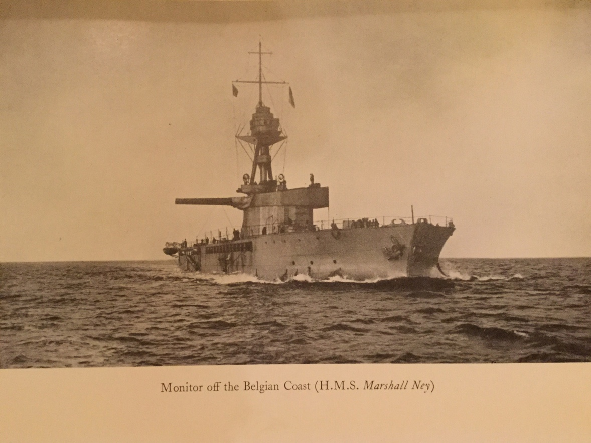

#CHAPTER XI

####MONITORS: THE BELGIAN COAST 1915-16

I was appointed to command the *Marshal Ney*, one of the new monitors mounting 15-inch guns, at that time supposed to be destined for a possible Baltic campaign. The *Marshal Ney* and *Marshal Soult* were still on the stocks. I was to superintend the fitting out of both of them and to command the first one ready. Taking up my quarters in the North Eastern Hotel I soon became familiar with Palmers and Hebburn where the ships were respectively building. At last *Marshal Ney* was ready and should be launched the following day. That night we experienced the first Zeppelin raid of the War, at least my first, not that I had much experience of it for I slept through it. In the early hours of the morning Mr. Gowan, managing director of Palmers, called at the hotel to say there had been a raid, many people in the yard had been killed, and some damage done to *Marshal Ney*. I went at once to Jarrow and the street leading down to the yard presented a scene of desolation, not that great damage had been done to the houses but it seemed that every window from every house had been blown out into the street. In the yard itself some fifty men had been killed and injured by a bomb which had fallen into the main fitting shop where work had been going on in night shifts. Considerable damage had been done to a series of destroyers' engines which were being erected. No bomb had fallen on the ship but splinters from one that had fallen near had pierced the side and deck plating. The Zeppelin had come quite low down, no anti-aircraft guns existed nor was there any organization for putting out the lights; under the circumstances it was indeed lucky that far more damage had not been done; the launch of the ship was delayed one day only, a disappointment one may suppose to the enemy.

My wife launched the ship I was to command, which should have been a good combination, but she, I mean the ship, never behaved very nicely. We were now destined for the Belgian coast and I had letters from Admiral Bacon urging the importance of her appearance on the coast as soon as possible. But there was much to be done; the first design had provided no bridge or compass platform. I had to point out it seemed to me impossible to navigate a ship approximately ten thousand tons with a beam of ninety feet without some sort of position to con her from, the idea being she should be handled from a conning tower on the fo'c'sle underneath the turret guns, an almost untenable position when the guns were firing and providing a very restricted vision. A bridge was eventually built between the legs of the tripod mast, a high and lofty perch reached by a vertical iron ladder but which proved an excellent vantage point for the intricate pilotage we later had to face, it was also easily accessible to the control tower itself from where I eventually fought the ship. Nothing really caused any delay in dates of completion except the main engines; these were Diesel, a set that had been erected by Whites of Cowes, designed I believe for an oil tanker, they were bought by the Admiralty off the bench and put into the *Marshal Ney*. With them came Mr. Swan, an engineer-lieutenant, R.N.V.R., a great character, and who will, I think, remember the engine-room of the *Ney*. To use Admiral Bacon's expression in a report he subsequently wrote, “*Marshal Ney* committed during her time on the coast every vagary which it is possible a ship could commit.”

The initial trouble was to get the engines to start. Experience of cranking up a stubborn car on a cold morning will indicate the sort of trouble. The engines were started by compressed air applied by means of air bottles; if the first bottle failed to do the job it was necessary to put another in position — a delay of ten minutes. We started, I think, with four of these air bottles, before we finished the engine-room was festooned with them. If, as so often happened, all the air bottles were exhausted before the engines fired it was necessary to recharge from the air-compressing engine—a lengthy business.

Every effort was made to get the ship through her trials only to return time after time having to report failure. More urgent letters from the admiral; a last one that General French was depending on having the *Marshal Ney* on the coast by a certain date. We began to feel important, but that did not make the engines less obstinate. The main trial was one that entailed continuous steaming for four hours; speed was of small importance. She was, I believe, designed for eight knots, we never achieved more than four and a half; the difficulty was to keep both engines in action at one time, but I think we never achieved this for a whole trip. Curiously enough, however, only on one or two occasions did both engines break down at the same time. At last I told the contractors that if we could get one hour's continuous steaming I would take the ship. At the end of the hour the contractor's party were into the waiting tug, and I was free to make a start south, a trawler on each bow as submarine escort. These monitors were the first ships built with bulges, and with ten-feet draught were fairly immune from torpedo attack; they were also fitted with spurs, the idea being to stretch wires between the spurs to keep mines from coming in contact with the ship's bottom. These proved a great nuisance, were always fouling something, even the cable, and were soon dispensed with. The ship was approximately three hundred and twenty feet long and ninety-three feet beam; with her shallow draught she had much the same qualities as a washtub, if too much helm was used she would start to swing and it was just as well to let her go right round, no amount of helm would stop her if she really got going.

It was not long after we started before the first engine gave out. I spent a good deal of that night in the engine-room and began to learn something about Diesel engines. About midnight, while in the engine-room, the officer of the watch called down the voice-tube that there was a submarine on the starboard bow and the trawler was sending up rockets. It did not take long to get on the bridge and as soon as my eyes got used to the light I realized the supposed submarine was a line of breakers, that the trawler was ashore, and we were in great danger of being ashore too. It was evident that owing to continually stopping, turning half-circles most of the night, together with the fact there were no coast lights to check the dead reckoning, we were outside the Haisborough shoal instead of inside. It happened it was the port engine on duty at that time and we must turn to port; would she do it? One daren't stop an engine in the *Marshal Ney*, at least not unless you had plenty of time to start again. One held one's breath as the breakers got nearer and the helm apparently had no effect, but slowly she came round, once having got her on the swing the next job was to stop her. That little trouble over we recovered our position and got back into the swept channel, stood on through Yarmouth Roads until in the neighbourhood of Harwich a flotilla of minesweepers came rushing at us, an admiral's flag flying in one, and the signal also flying: “You are standing int. danger, alter course 180 degrees, new swept channel so and so.” It was by no means easy in the *Marshal Ney* to keep a steady course, to turn round after we had come so far and so slowly — the new course meant a detour of some fifty miles. Fifty miles at four and a half knots, a long way, and my time for arrival on the coast was getting near; it was not possible to explain all this to the admiral, I had still to calibrate at Shoeburyness; I had to risk it. It was Admiral Charlton's flag flying and I should have liked to have heard from one of his staff what he really said; my immediate reply was to hoist “not under control balls” and get Morgan, my navigator, to work out the shortest way to the new channel without going back on our tracks. It was somewhere inshore on our beam; by suitable signals exchanged, to pass the time, we worked safely on to the new channel. In the meantime we were also being bombarded with signals from the commodore at Yarmouth who was perhaps naturally surprised at the trawler having been left ashore on the bank, she got off eventually and I, having taken the blame for her being where she was, heard no more about it.

In due course we arrived at Sheerness slightly overdue in the matter of sleep but otherwise all well, and having learnt a lot about the ship. Calibration passed off without incident and in one respect we should come up to expectations, thе turret and guns were the latest thing built for a new battleship and transferred bodily to us.

Our arrival at Dover was not all it was meant to be. It was on a dark winter evening with a stiff breeze and a strong tide across the entrance. As our bows got into still water, with the stern still in the tideway, she did the complete imitation of the washtub and turned sixteen points. We came in stern first and moored going astern, making quite a pretty evolution of taking up our berth in a crowded harbour and all done quite involuntarily.

The next morning the grand flotilla sailed, consisting of some thirty miscellaneous ships — monitors, destroyers, drifters, trawlers, minesweepers — headed by Admiral Bacon. We, more or less the *pièce de résistance*, were to follow the flagship. As the admiral passed, he hauled down the usual signal to weigh and proceed out of harbour but nothing happened, the engines refused to respond; there was nothing for it but to drop an anchor again and proceed to the engine-room to the moral support of a sweating Mr. Swan, what time the grand flotilla was disappearing across the Channel. A recharge of bottles and this time one engine fired, we started off. There was nearly a fearful contretemps. Those in charge of the gate had given us up and closed the gate; it was quite impossible to estimate the exact time of our starting and having started it would be fatal to stop, so there we were steaming, luckily slowly, towards a closed gate. Relief can be imagined when in response to our shrieking siren the gate was opened just in time. During the night we more or less caught up the flotilla — they in blissful ignorance of the danger they were in from this unruly great tank always more or less out of control with no lights showing.

I had never been in Dunkerque and when the signal was made to proceed up harbour and secure up alongside another monitor already lying alongside the jetty, my first inclination was to say: “Sorry, but that's impossible.” However, I suppose in wartime every one is brave and in we went. By that time we had both engines running but had developed a new trouble. The steering engines were a little primitive, consisting of two engines similar to those used in trawlers mounted on the bulkhead of the steering compartment connected by chains to an iron yoke. These two engines had started off well enough down the North Sea but by the time we got to the Channel definitely disagreed, either the bulkhead had a certain amount of play or one engine was more enterprising than the other — they got out of step.

Whatever the cause, we found ten degrees of helm was all that it was safe to use, beyond that it could not be righted without stopping the ship.

As I surveyed the entrance to Dunkerque, that long narrow channel bounded by wooden piers each side and leading to an inner entrance and basin, I wondered sadly which pier we should punch and what would be the result. However, we went many times in and out of that harbour and it was quite late in her career on the coast before it really happened. Our first entrance was good. Usually I took the helm myself, it was too great a temptation for any helmsman when he found a swing commencing not to shove on plenty of reverse helm, with fatal results. The only remedy was to watch most carefully for the first sign of her head moving. As I said the first entrance was good, at least till we got near the end, when it was necessary to stop and go astern. She stopped all right but would not go astern, and we slid gracefully on to the silted-up mud at the end of the harbour. No harm done; after waiting for a rise in the tide we warped successfully into our berth. We lay, six big monitors two abreast, many nights in Dunkerque. Many air raids and shells from Long-Tom firing from an incredible distance, but in spite of the target we presented we were never any of us hit in harbour.

The morning following our arrival proved definitely amusing; we in the *Marshal Ney* were to engage the Tirpitz battery near Ostend. Tirpitz had four 15-inch guns with a range of some 34,000 yards, we had a range of 30,000. The navigable channel lay roughly parallel to the coast and this coast was bristling with guns of various calibres. It was necessary to keep the fire of these other guns under control before any success could be expected with Tirpitz; other monitors and coast batteries undertook this part of the business. But where the enemy had so great an advantage was in his observation posts for spotting, which could be anywhere convenient abreast the ship connected by telephone to the battery. We from the control tower could get fairly good direction for line as we could see the flash of the enemy guns when they fired but for distance we were dependent on spotting from the air — generally unsatisfactory, not from any fault of the airmen, but because the visibility was nearly always unsuitable. We had kite balloons but they were better down than up if there were enemy planes about. Lastly we had Lieutenant Shoppee, a gallant officer who spent much of the War in an old tower at Nieuport. Shoppee bore a charmed life, for the enemy soon found out he was there and before long there was very little tower left, but he stuck to the remains with the help of a ladder; he gave us the best help but the drawback to his position was it was not far out of the line of sight. The admiral had an amazing device to help spotting, consisting of an immense tripod broad and heavy at the base. This was slung to a trawler which proceeded close inshore during the night and pitched the tripod into the sea where it stood upright, having on its upper end another hero named Bickford. It was, however, difficult to exactly judge the rise and fall of the tide and the depth of water in which the tripod would stand. When morning light came sometimes the unfortunate Bickford might find himself well out of water asking to be shot at, at others having to take to his Gieve waistcoat having been floated off. To return to our first shoot we got half-way through the Zuidcote Passage when the steering gear gave way altogether and we had to take to the hand wheel — a large and cumbersome affair on the quarter deck. Frantic signals from the admiral: “Why don't you get into position?” to which I replied: “We are coming on, steering by hand and one engine out of action.” We got into position and at last fired. By this time Tirpitz was busy and making first-class shooting, but of course a ship at fifteen miles is only a speck on the ocean, the heavy stuff from Tirpitz constantly pitched just over or short, right or left, they never registered a hit. It only meant one as far as we were concerned, there was no protection except the turret, and with the angle of descent not much there, the rest of the ship was just a biscuit box. The effect of the shells was interesting and alarming. I had in the control-top with me Bruce Gardyne, the gunnery lieutenant, Morgan, the navigator, and the ship's master-at-arms, an annoyingly cool customer. His job was timekeeper. He had to note the flash and with a stopwatch the time of impact. With all the other orders going on — aeroplane reports, signals from the shore, from the flagship, reports from the turret, etc. — one would hear in the background: No. 1 fired, 10 seconds, 20 seconds, 30 seconds. No. 2 fired, No. 1 due to arrive and about that time a noise like an infuriated traction-engine hurtling through the air, a terrific bang as the projectile hit the water and a second as it hit the bottom and exploded; before the pit of your stomach had got more or less on an even keel you learnt that No. 2 or No. 3 was due to arrive.

In the meantime we had made good shooting, and the aeroplane having reported hitting I had ordered “rapid fire”, when Mr. Swan rang up to say we must either stop using the engines or stop firing the guns as his air bottles were exhausted and they were using the air compressor for the turret air blast. I signalled to the admiral that I proposed to anchor as I could not keep the engines and turret both in action; he, however, made a general signal to withdraw and we retired on Dunkerque having had quite a busy day if not very successful.

The weather broke, the admiral retired to Dover, and I was left temporarily S.N.O., Dunkerque, which meant besides the bombarding, a multitude of minor matters, Dunkerque being one of the ports of supply of the British Army. Most days we were out firing at one or other of the enemy positions but it was never worth while to stop long when he once got the range. At Dunkerque there were many interesting people coming and going. I went up to La Panne and had the honour of lunching with H.R.H. Prince Alexander of Teck, now the Duke of Athlone, at that time with the British military mission, under General Tom Bridges, helping to remodel and rearm the Belgian Army which had withstood such tremendous battering during the early days of the War. It would take too long to recall all the many incidents of daily life on the Belgian coast during the autumn and winter months of 1915 but at last the day came when the conditions seemed favourable to make another attempt at the big battery. All went well and we were again reported as hitting. How good our shooting was I had no idea until many years after I had a first-hand account from the commander of the battery himself.

Once more when we appeared to be so successful, the *Marshal Ney* misbehaved, both engines broke down, I was helpless to even keep the guns pointed. Evans, long afterwards to relieve me as C.-in-C. at the Cape was then a commander and captain of the Destroyer *Viking*, came to my rescue, making a smoke screen and passing a wire on board towed me out of range. It was an unpleasant retreat; we were being continually just missed and could not retaliate as the guns would not bear. Moreover, the ship, having no engines, was quite unsteerable and yawed at right-angles to the tow at times. I suggested to those in the top a retreat to the conning tower would be a sound move. However, Gardyne and Morgan, who I suppose had a greater contempt for Germany gunnery than I ever felt was justified, were arguing about something when one of the flying traction-engines passed so close to the top I could feel the hot wind it made and I could not help saying: “Well, gentlemen, I suppose as captain of the ship I should be the last to retire from this top but it seems to me an unhealthy position and I do not mind if you hurry.” After which they got a move on.

Out of enemy range, we dropped an anchor and got the engines once more a going concern. Then the admiral made me a signal to come on board the *Lord Clive* where his flag was flying. I pulled over in the whaler; on the way over an infernal German aeroplane started to drop bombs, presumably aiming at the ships at anchor, but it seemed to me that in my little boat I was definitely the target. Actually I was, I suppose, as safe as one could be under such circumstances; the odds of a direct hit would be infinitely small; all the same it seemed a very personal affair. Admiral Bacon had an idea that if I went close in to the shore off La Panne, Tirpitz would not be able to train round sufficiently to get me, so in we went not more than a hundred yards off the beach at La Panne. The channel was so narrow I had to drop an anchor riding at a short stay on the slip. H.M. the Queen of the Belgians took some photographs that afternoon from the shore and they show the shell-splashes round theship clearly, for they trained round all right and very soon got our range. We on our side for some time failed to get any satisfactory spotting correction but we did blow the slip off the cable with the shock of our own fire and very nearly the cable officer (Lieutenant Amit, R.N.R.) as well; he had gone forward to stop the cable running out when I got a correction and not knowing he was there, gave the order to fire. Poor Amit nearly went into the sea. Things were getting rather warm and I was quite willing to obey the signal once more to retire.

Our day was not quite over, on our way up harbour the steering engine failed, we started to swing, the engines were stopped and put astern but failed to respond, both anchors were dropped and attempts made to bouse them to. Amit was having the time of his life with sparks flying from the cables which might at any time part. But still we went on, punched the pier good and hearty and rebounding left a large round gap ninety feet across. My friend the port admiral came on board and upraided me for anchoring in the fairway. I did my best to explain this was no ordinary ship and pointing to the dented pier tried to make him realize that without anchoring there would now be no pier. I believe he reported that we were not the sort of ship the French port authorities appreciated.

We were ordered to Cowes to have both our main engines and steering gear put on better terms, also to have our range increased by additional elevation. The voyage down Channel was not without incident; our troubles came from a signal received just as we were approaching the Folkestone gate: “Gate is mined — return to mid-Channel before steering west.” We did, but there was a hitch somewhere; we had no knowledge there was a drift-net barrage to the westward and about midnight we were all in among them. It took hours to get clear and when we eventually got into dry dock at Southampton we had wire nets and glass balls in abundance on all our mine spurs. In dry dock we altered the balance of the rudders and then to Cowes, a peaceful spot far removed from war. The idiosyncrasies of the ship had not been without wear and tear on her captain, and a fortnight's rest in Cowes roads while Messrs. White had a go at the engines was most acceptable.

We were urgently required back on the coast, there was a scheme afoot which eventually, a long time after, developed into the Zeebrugge raid. As I knew it, it was to be a definite landing of troops over the monitors by specially constructed lighters; my part was to push in at night until my nose was well ashore to engage the battery at more or less point-blank range, while other ships dealt similarly with other batteries. A risky business; it had possibilities but there was one thing it was impossible to legislate for, the weather; just a little wind getting up, a moderate sea, and the transportation of large numbers of troops would become dangerous if not impossible. The troops were never available for such an operation nor, as it happened, did I personally appear again on the Belgian coast.

Arrived back at Dover without incident we were in process of trying the engines preparatory to leaving again for Dunkerque when as I was writing in my cabin, Mr. Swan rushed in, an excited and thoroughly upset Mr. Swan and moreover covered in black oil from head to foot: “Good God, sir, she's blown up?” She had, or rather a cylinder head had blown to fragments; some as big as your two fists had gone up through the deck and through the bulkhead, but that no one was hurt seemed a miracle.

That was the end, we were ordered to Newcastle to pay off and transfer our guns to the *Terrible*, building at Belfast. Before leaving the Belgian coast perhaps one more incident is worth relating.

Information came in that a new German division had arrived on the coast and that the Divisional General and his staff had taken up their quarters in the Casino Hotel on the beach at Middlekerke. It was considered possible to deal with this, and I was to be off Middlekerke before dawn, to plant a shell in the hotel as soon as light permitted me to see it. As far as we could make out, the shell pitched right in the middle of the hotel, the whole place appeared to go up in dust and smoke; how successful the shot was I heard confirmed some months afterwards. The engines behaved well that morning; luckily, as the explosion roused the whole coast, but it was still dark enough to get away unseen.

Whether the monitors on the coast ever accomplished anything has often been the subject of discussion. Perhaps it was always hoped that with the aid of the monitors a flank attack behind the German lines should take place. As time went on, there was less and less chance of troops being available for such an enterprise, so the chief use of the navy on the coast was to keep the enemy guessing, and if less was accomplished than was often hoped, large concentrations of enemy troops were held on the coast expecting a landing.
