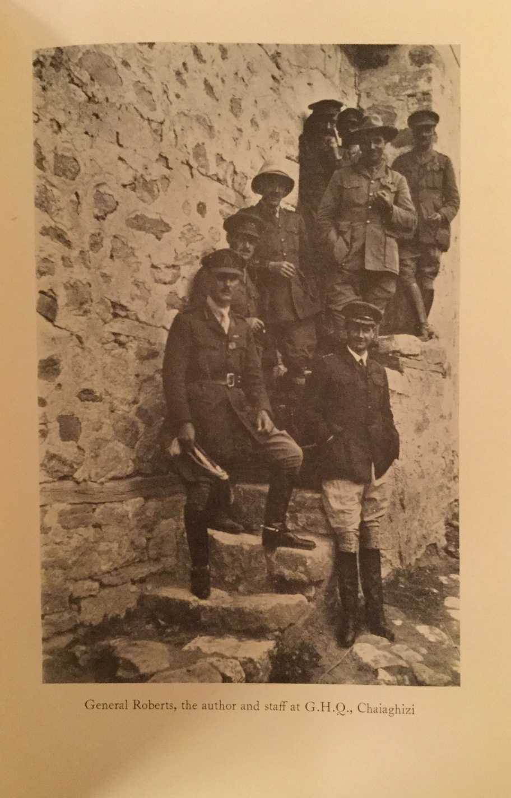

#CHAPTER XII

####SUEZ CANAL AND EASTERN MEDITERRANEAN

Paying off the *Marshal Ney* at Newcastle, after hoisting out her guns for despatch to Belfast, I and the ship's company left for the same place to commission the *Terror*. It would, however, be some time before she was ready and it was not long before I was ordered to take command of the *Sir Thomas Picton* at Ismailia on the Suez Canal.

Travelling in the P. & O. from Marseilles to Port Said, I met by chance two soldiers, both of whom had been wounded in France and were now returning to India to rejoin their regiments.

The first had been long ago with me in the Bumpeh River expedition, and he asked me casually one day why I was not wearing the African Medal. It was the first time I had heard of such a medal being issued, but some weeks later, lying in my bunk with a go of sand-fly fever and having nothing better to do, I thought I would write and apply for that medal. To my intense surprise, in a very short time, a medal “Sierra Leone 1898”, clasp complete, arrived in a cardboard box inscribed Sub-Lieutenant Tweedie. Presumably it had been lying in a pigeonhole all these years. It must be rather unique to have earned a medal as a sub-lieutenant and receive it as a post captain.

My second passenger friend had been in the intelligence section, Belgian coast. Yarning one night he told the story of how they had got information of a big German general and his staff being billeted in the hotel at Middlekerke, and how the admiral had sent a ship and blown the whole place up. “Yes,” I said, “it so happened I was the captain of that ship he sent.”

Life at Ismailia was dull, we were there to assist in the defences of the Canal against a possible raid. There had been one, not very serious and easily dealt with. But I soon realized there was little chance of our being used, and reported accordingly that our present duty would appear to be a waste of a ship if she could be employed elsewhere. I was ordered to Imbros, by then a deserted port with all the debris of a departed army upon its shores. The southern coast was strewn with wreckage; dead mules, harness and accoutrements of every description, ammunition boxes, hundreds of cases of condensed milk, bully beef, as well as two of the big K lighters. Inside the harbour two of the dummy battleships had been sunk to form a breakwater. These had not weathered well and had taken up different angles, while part of the false funnel had come adrift. They looked for all the world like two drunken and dissolute old women.

Our orders were to bombard certain positions on the Asiatic side, but primarily to watch for and engage the *Goeben* and *Breslau* should they come out.

Our position was precarious. It was necessary to lie inside the bluff both as protection from the weather and from submarines, and from this position we could not see the entrance of the Dardanelles. We had therefore to establish a constant look-out on the bluff itself.

As the weeks went by, it was necessary to clean boilers and to put the turret out of action from time to time to repair leaky valves, and if the *Goeben* came out at such a time, she would be across before we could either raise steam or get the turret in action.

Having studied the question, I wrote a memorandum to the C.-in-C., pointing out that under the most favourable conditions the ship, efficient enough for bombarding, was quite unsuitable to engage a ship like the *Goeben*. That in poor visibility or in special circumstances, she would be across to close quarters unseen and there was little chance of putting up a satisfactory fight.

For two months we lay at Imbros, and were then relieved by the *Raglan*, a similar ship. A month later the *Goeben* came across and sank the *Raglan* at anchor. The only redeeming feature was that the *Breslau* struck a mine on her way back and was sunk.

From Imbros I was ordered to Stavros, a much more interesting field of operations. Stavros was a charming little spot, although the local inhabitants were not so trustworthy. The village was run by the local Greek church patriarch, a venerable and imposing-looking figure. Actually, my predecessor had been very kind to this old man. One Sunday afternoon I was taking a walk in the vicinity of the village when I heard a tremendous hullabaloo going on. I walked in to see what it was all about — a somewhat dramatic scene — there was the old patriarch with a rope round his neck, the other end over the bough of a tree; the old man was about to be hung for something. Having no authority whatsoever, I held up my hand to stop the proceedings. A Greek police officer informed me that he and his party were Venezelos men, or belonging to the party which favoured the cause of the Allies, as also did our patriarch. The officer now denounced him as a traitor. He had, it appeared, been sendIng regular reports to the enemy of all movements of ships in Stavros, or of army movements on the adjacent front. The old man had nothing to say, but did not wish to be hung, and by this time nearly the whole village were on their knees begging me to save him. It was no good explaining that the business was nothing to do with me, both sides looked to me for a decision. I suggested he should be taken away for a trial, and the police suggested in lieu of immediate hanging, they should burn his house down and the village, all of which he apparently owned. I nodded consent. The villagers fled in every direction to save their own particular bits and pieces. The incident, dramatic in itself, also showed how divided the feeling in Greece was at that time.

The squadron at Stavros consisted of either the *Edgar* or the *Endymion*, my ship the *Picton* and a smaller monitor. Odd store ships and hospital ships came and went. It was an open anchorage carefully surrounded by a line of buoys to represent mines, with an entrance gate. The ruse served to keep the harbour safe from submarine attention during the whole period of the Salonica operations. Either the *Picton* or one of the cruisers would be on duty daily at Chaiaghizi, some six miles across the bay, at the mouth of the Struma River. At this point the right flank of the army came down to the sea.

We were kept busy bombarding enemy concentrations behind his lines, new trenchworks observed in the foothills opposite, and so on. For this we lay close in to the beach at the end of our wire, so that we could enfilade any attack and cover a good deal of the country at night with our searchlights.

We, in the ship, had the only heavy guns on our side in the sector. The position was strong, but regiments very much below strength due to malaria, the worst enemy we had to contend with. It was not thought likely the enemy would attack in this sector, but in order to contain as many men as possible, several feint attacks were made on him at night. These attacks we assisted and we got so skilled as to be able to put down a creeping barrage of twelve-inch shrapnel, which pleased the army enormously, but rather terrified me, for we had little to check our fire on except the enemy rifle-fire from the hillside. These night attacks were exceedingly spectacular from the ship, and the brigadier considered them excellent for the morale of the troops, taking their minds off malaria. Moreover every attack was invariably followed by a good crop of surrenders. They did not like the ship's guns.

In order to achieve accurate indirect fire it was necessary very carefully to fix the ship and secure her. For this last we had two bowers broad out and hove taut against each other, and two more anchors one from each quarter. This was all very well until the enemy woke up and brought a gun down on the beach or near it, when we were bound to catch it.

One of my extra jobs was to take agents along the coast at night and land them, picking them up again in a week's time or longer. From one of these people we got news of a supposed submarine base a few miles along the coast. One dark night we raided this place and took off some twenty tons of lubricating oil, certainly collected there for some one. The brigadier was convinced there was no enemy down on the beach or in the foothills directly in front of me. However, he arranged to send out the Yeomanry to reconnoitre while we stood along the shore to cover them. We had a wonderful view as they trotted out in extended order across the plain, but as they got near the foothills they came under machinegun and rifle-fire. The whole line was soon making good time at full gallop retiring, while we opened fire on the enemy positions which were now disclosed for the first time. There were no casualties beyond one or two men unhorsed. These made their way down to the beach and were brought off to the ship, the horses being swum behind the boat and landed again behind our wire. A small service, but rather an exceptional one for the navy to be able to render the army. We returned to our berth and moored up as usual, but after dark I had a feeling that things were going to happen and gave orders to unmoor and move a little farther out where we would lay at short stay. It was well I did, for about daylight the first shell passed overhead. As I ran forward they registered the first hit, luckily for me a dud. They were firing pretty rapidly but going a little over. Had he come down a hundred yards we should have had an even more lively time. As I had anticipated, it was not possible to locate the guns firing, but we could get the line, and by the angle of descent they were a good way off. Unfortunately one of the first hits landed on the foc'sle, knocked out the chief stoker, and cut the steam pipe from the capstan engine.

By that time I was on the bridge and sent Farquhar, the navigator, forward to slip the cable. As he was standing in the eyes of the ship a shell burst at the base of the turret, and two or three more on the near-side bulge. Fragments of these hit Farquhar, and I saw him clap his hand to his shoulder and then spin round as he was hit again. However, he got the slip off, and enough steam to get the anchor underfoot. Meanwhile the turret had got going, with shrapnel bursting at three thousand and going up five hundred each round. In a hectic ten minutes during which one was fully occupied it is curious how much one sees out of the tail of your eye so to speak. My messenger boy got a nasty one which nearly took his foot off. I heard him say “Oh, sir, look at my foot,” and the stretcher party came doubling up to take him below. I noticed Stride, an R. R. lieutenant, was badly hit, that most of the pom-pom crews aft were lying on the deck. The enemy went on firing for some time but was not strong on training round. As we went astern, the shots continued to pitch in the position we no longer occupied. A strong party of infantry, no doubt enjoying the fun, were exposing themselves along the foreshore. Around of shrapnel soon put them under cover.

We discharged our wounded into a lighter for shipment to the Army Field Hospital at Stavros, and then went back to see if we could locate our friend, but he wouldn't fire any more. My starboard bulges were holed and flooded, and some holes in deck plating, otherwise not much damage. My friend the brigadier sent down to say how concerned they were to see us getting such a pounding and being powerless to help. They thought we were on fire, which was of course the steam escaping. Stride, of the officers wounded, had a very bad time, as on top of his wound he picked up malaria; but as a reward for his services that day, and others, the Admiralty gave him a regular commission as lieutenant. Farquhar was soon back, with his arm in a sling and a patch on his head, and full of work.

We went on at Chaiaghizi for some time, and had considerable success at targets twenty thousand yards away and more, for we knew the calibration of our guns now almost to a yard. We were next ordered to Salonika. At that time in the Market Square at Salonica you could meet the soldiers of all the allied nations, the surging traffic controlled by British police quite as much at home directing strings of camels and donkeys as they would be cars in Piccadilly. In the club I met Venizelos, the stormy petrel of Greek politics then banished from his country, and Admiral Troubridge working at that time with the Serbs. The situation in Greece was critical, with the pro-German party holding the upper hand. If they came down definitely on the enemy side it was going to be difficult for the allied army, as geographically, Greek country lay in the rear of the left flank of our line. I was sent for by Sir George Milne and told it had been decided to cut the railway in Greece, that a Greek declaration of war was expected hourly. The railway connecting north and south Greece runs along the edge of a cliff at the head of the Euripo Channel. I was to proceed directly after dark, and at daylight pound the cliff and the railway. It was expected the whole would collapse into the sea. I studied the railway maps and heard what the experts had to say. It all seemed quite feasible. I also studied the latest information as to the enemy gun positions. It seemed, helped by the element of surprise, we might get there. I didn't say so, but thought our chances of getting back were just about nil. Our top speed was five knots, the channel so narrow that even field guns had a good chance of disabling us. We actually weighed, and were proceeding down the gulf to carry out the operation, when we were recalled. Terms had been come to with Greece with sufficient guarantees of her continued neutrality.

The daily air raids at Salonika were interesting, with a good deal of firing from ship and shore batteries. A zeppelin was hit and fell in the nearby marshes.

A little later I was ordered to Malta to repair damages and replace the turret guns which had fired many more than their allowance of rounds. On the way to Malta we met bad weather and the experience was interesting, and there follows a report of the voyage which I made at the time, really for the benefit of other monitor captains.

#####12-inch MONITOR *SIR THOMAS PICTON*
######*Behaviour in a Gale forty Miles North of Crete 21st and 22nd - january, 1917*

The following notes may be of interest to officers Commanding and engineer officers of H.M. monitors.

*Ship on passage Salonika to Suda Bay.*

Sunday, 21st January at noon ship passing between Siphano and Anti Paros. Course south, sea calm, slight following breeze, barometer steady 29.92. Course S.S.E.

3.0 p.m. Wind freshened, still right aft, and engines were eased to 140 revolutions. Barometer rising.

The intention was to hold on until midnight or until Cape Drepano light was sighted, and then face the wind until daylight.

By sunset the wind had increased to a moderate gale, with a heavy following sea.

It was apparent we could expect a bad night, and the problem presented itself of whether to turn round immediately and endeavour to gain the lee of Milo or to stand on until within daylight distance of Suda and then heave-to.

It was decided the wind was already too strong to make it possible to regain Milo, and that by heaving-to where we were we should in the morning be too far off to make Suda during daylight hours.

On the other hand it was most important not to make Crete, a dead lee shore, unless we were sure of our position and able to go on.

The fact of the ship becoming quite unmanageable was not anticipated. At 10 p.m. the engineer officer reported the engines were racing dangerously and it was very difficult to control them (there is no governing gear fitted), about the same time a heavy sea swung the ship round broadside to the wind and it was impossible to get her off the wind again.

Endeavour was then made to turn her up into the wind, but without success. At 10.25 p.m. a report was received from the engine-room that condensers were getting hot owing, it was thought, to air pockets being formed under the ship and suction being lost.

Both engines were stopped.

At midnight it was blowing a full gale with very heavy sea. Ship lay about broadside on to the wind and sea, the latter breaking over her fairly heavily.

There was by now about thirty-six miles of sea room and with an estimated drift of three to four miles it appeared necessary to ask for assistance.

In the meantime the two after-bulges each side and the after ballast-tank were flooded in order to keep her stern down, and the ballast pumps were put directly on to the condensers with good results, and at 11.30 p.m. went ahead.

The condenser trouble had been got over, but the racing was still bad and the ship could not be got nearer than three or four points of the wind.

At 0.30 a.m., on the morning of the 21st decided it was necessary to make an effort to go about, the helm was eased and the ship allowed to fall off to gather way, the engine-room being warned what was to be done and told to get all the revolutions possible.

Judging the ship had as much headway as possible the helm was eased down gradually and ship coaxed up into the wind.

She came within a point of the wind and hung for some minutes, a final appeal to the engine-room kicking her round.

It was now possible to keep her on a course N.E. by N. and N.E. by E., wind N. by W., revolutions as near 150 as possible.

Estimated course and distance made good—S.E. 2 miles per hour, actually it proved to be S. by E. 2.5 miles per hour.

At 6.0 a.m., it appeared there was a slight improvement in the weather, and decided to make for Suda.

Double-bottom compartments aft were flooded and ship turned stern to wind to S.W.

Weather continued to improve all day though still heavy, and harbour was made without further incident at 3.0 p.m.

It is to be noted that ship was handicapped by having two bulges right forward already full; also spare ammunition on board trimming the ship by the head, a condition to be avoided.

The *Snaefell* was sent by the S.N.O. Suda Bay, and closed at 3.30 a.m. If weather had not moderated an attempt would have been made at daylight to get in tow; whether possible in that sea remains a problem which it is satisfactory to have been able to leave unsolved.

On arrival in harbour, six bulge compartments had been flooded, also the aft ballast-tank and after double-bottom spaces in order to keep the propellers in the water.

The ballast pumps were used continually for supplying condensers, and were quite satisfactory.

Leaving Suda we met strong headwinds. One day's record was fifty miles astern and it took us seven days to complete a trip usually made in two. We had no sights for some days, and I was not altogether surprised when we found ourselves at daylight one morning heading for the Comino Channel instead of the entrance to the Grand Harbour. When we eventually did arrive at the entrance, we were told to wait until the channel was swept. This was a bit over the odds, it was nearly nine o'clock. As I passed the breakwater the sweepers passed out. It seemed early rising was not a strong suit in Malta, or possibly we were keeping different time. Anyhow, it was a delightful place to get to for a short time and forget the War. It took a month to put us right and change the guns.

We were ordered to Venice to work under the Italians, calling at Taranto on the way to report to Admiral Mark Kerr, who was nominally in command of all the British forces in Italy. Then on to Brindisi where the Italian admiral was duly alarmed at our speed, or lack of it. He said we should be attacked by the Austrian ships lying in Cattaro. “Always”, he said, “we pass quickly by night, but you cannot pass quickly.” That seemed true enough. “However,” he said, “I will send an armoured train. The line runs along the coast. You will keep close in.” I suppose this doesn't sound very funny. It seemed to me at the time intensely so. The idea of this formidable fleet in Cattaro which it was so necessary to “pass quickly in the night”; and yet, that if it did come it was to be sent scuttling home by a solitary gun mounted on a train did seem rather hard to believe in.

We wandered up the coast with our train escort until we got to Ancona. From here was a different procedure. I was to pass inside the minefields off the coast, led by a destroyer whose captain I was told knew exactly where the mines were. After steaming so many miles I should see a red light, at this point we were to turn at right angles to the first course, and so on. As liaison officer I had on board a commander from the *Trentino*; an amusing customer with a wide circle of friends in England. There are many good stories of his exploits, but as I hope he is still in the land of the living, it would be discreet to say little. He was a whole-hearted friend of England, and very outspoken about the two parties then in Italy. So many of his countrymen were, he said, always “In reposo”.

We left Ancona at night, and the time came when by our reckoning we were up to the turning point where we should see the red light. If we stood on we should be in the minefield. I told my friend to call the destroyer alongside and ask him if he was sure of his position. The reply was to the effect that he had not the slightest idea where he was, which seemed an enormous joke to my liaison officer, suggested we had better anchor, to which they heartily agreed. No sooner had we done this than on went the red light. The watchman had, I suppose, been “In reposo”, and I had a feeling that it was the noise of our cable that had woken him up.

Venice, in wartime, was interesting. I had been there before, so could appreciate the difference, which was indeed largely a matter of food. Most of the hotels were open but you brought your own food. The Campanille, Doges Palace, and most of the ancient buildings were well protected by sandbags from air attacks, which were frequent. These did on the whole very little damage, partly explained by the large proportion of water, to land, in Venice, which can be well appreciated from an air view. There was also a very good barrage balloon system, which kept the planes at a great height. Presumably it is the same system that is to be introduced for London.

In the dockyard an Italian monitor was being built, which they were very proud of. She was on similar lines to our monitors, but the bulges instead of being built into the ship were secured by chains. Shortly after she was put into service the Italians retreated, the monitor put to sea from Grado with large numbers of troops on board. Outside she met rough weather, the chains broke and she capsized. I went up to the front line with my Italian friend, who seemed to have friends everywhere. We went nearly to Goritza, but it was not long before there was a general retreat, and even talk of abandoning Venice. We did indeed take up a position to the westward of the town, from where we were to shell the advancing enemy.

From my point of view this Italian Front was not very satisfactory. We had many conferences overnight when every one was very bloodthirsty. Attacks were planned, but the morning came, and there was usually a good reason for postponement. Admiral Mark Kerr was very anxious to see what we were doing, and I promised to let him know if there was anything coming off, but it was very difficult to give him enough warning as to when we were going out, and so often we went out only to return having done nothing.

Owing to my lack of speed, it usually meant my leaving harbour directly after dark in order to arrive at the rendezvous at dawn, when I was to be met by cruisers, escort destroyers, aeroplanes for spotting (Italian), Avion de chasse (French). Dawn would break, and we would have the sea to ourselves, receiving in due time information that the operation was postponed and I was to return to harbour. However, we did at last get the admiral embarked, and he duly hoisted his flag. I do not remember that we accomplished very much, but an enemy plane did manage to drop a bomb on us. It did little damage.

I was three months in Venice, or Grado, and met many charming Venetians, but Italy was not in a very happy state. The north despised the south, there was a pro-Allied party and a pro-German party; a pro-clerical party and an anti-clerical party. It was quite ordinary to be warned by some supporter that this or that high official was on the other side. I was glad one day to get a telegram appointing me to the *Champion*; curious it should be the *Champion* after all these months, for it was the *Champion*, then building, that it was proposed I should wait for, rather than go to the *Marshal Ney*.
