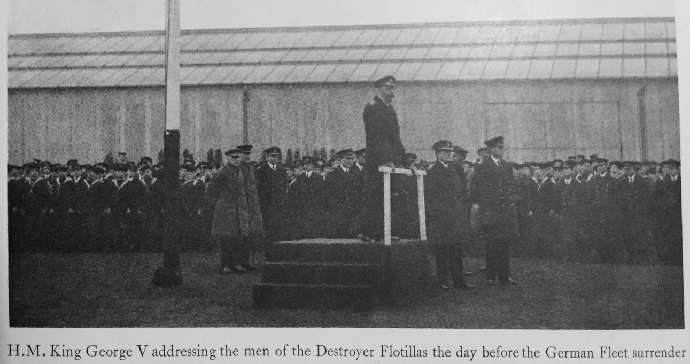
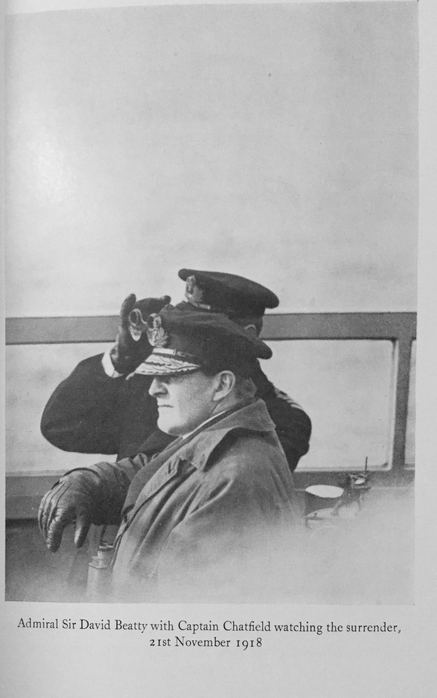

#CHAPTER XIV

####DESTROYERS–continued

Shortly after this unsatisfactory episode, I was sent for on board the *Queen Elizabeth* and greeted by Brand, Captain of the Fleet, with the information that the C.-in-C. Wanted to see me and that I was to relieve Hawkesley as Commodore Grand Fleet Destroyers. My reply must have appeared ungrateful enough, for I realize it was largely if not entirely owing to Brand that I had been brought back to destroyers at all and was now to be made commodore. I didn’t want to be commodore, I was just beginning to see daylight with the Thirteenth Flotilla, it was absorbing work and I believed they were perhaps appreciating what was being done. Moreover, I enjoyed working with the battle-cruisers, it meant much sea-time; my impression was that as commodore I should be more or less a figurehead and never go to sea unless there was a fleet action. I soon learnt that if Captain D. meant fourteen hours a day, seven days a week, the commodore could afford sixteen and more if possible. Of course, Brand pointed out that it really didn't matter what I thought, the C.-in-C. had decided, and Dutton would relieve me in the Thirteenth. I had, of course, seen a good deal of Sir David Beatty and was now to see a great deal more. He was a very great leader, inspired the greatest confidence in every one, hated detail, and expected a good deal from all under him. As I was shown into his cabin on this, to me, memorable occasion he was, as so often, walking up and down. He didn't say much but began the conversation with: “I will just give you one bit of advice. Never suffer fools gladly.” I don't know now whether he thought I had been committing that particular crime, but he went on: “I am not satisfied with the handling of the destroyers and I am making a change; if you can't do it I’ll very soon find some one else who can.”

I had Captain Dutton in the Thirteenth, Dan Godfrey, Fourteenth, Rowley Conwy, Fifteenth, Snatcher Stirling in the Twelfth, and Money, a torpedo man, came into the Eleventh instead of Gladstone. Each flotilla consisted of sixteen destroyers and two leaders, with the exception of the Thirteenth, thirty-two destroyers, two leaders with Captain D. in a light-cruiser. I myself hoisted my pennant in the light-cruiser *Castor*, so the command at that time consisted of two light-cruisers, ten leaders and ninety-six destroyers, personnel of approximately 12,000 officers and men.

I took over in Gutta Sound, the home of most Grand Fleet destroyers throughout the War. I had collected Clegg, as signal officer in the *Champion*. I had known him before the War, as signal officer to both Brand and Tyrwhitt, and met him doing good work on the staff of the admiral at Lemnos, but wasting his flotilla experience. He proved invaluable, one of those lucky individuals who after a long night on the bridge at sea, could start in on all the tremendous detail which always follows arrival in harbour, apparently as fresh as if he had been in bed all night. I also, by the advice of Spickernall, secretary to the C.-in-C., got hold of Woodhouse as secretary. I was sorry to part with Beall, and would gladly have taken him with me from the *Champion*, but he was debarred as being too junior.

Woodhouse proved a veritable treasure; he was to remain with me for many years, in different commands. He did not always agree with my methods, but I think I always agreed with his and he worked harder than any one I have ever met. I shall always be in his debt, both for the work he did and as a cheery messmate, no small asset in wartime. In the Battle Fleet flotillas, while at Scapa, we had of course no Port Edgar to fall back on, each flotilla had its own depot ship, which with very different capacity, had to cater for the same number of destroyers. By the organization then existing, by which the captain of the depot ship carried out the administration of the personnel and stores of the destroyers, it was very difficult to pool resources, which was often necessary. There was much to be done. My routine at Scapa, if it could be called a routine in which no two days were alike, consisted broadly of either interviewing commanding officers all the forenoon or going out with one or other flotilla for exercises, back in the early afternoon, and if possible ashore for an hour's walk and then at four o'clock settling down to paper work, which was prodigious. Every sort of subject came up; my staff, which besides Woodhouse, secretary, and Clegg, signal officer, included Davis, gunnery commander, Walker, and later Wake Walker, torpedo commanders, were hard at it; but everything had eventually to come to my baskets, which followed each other in rapid succession all day and far into the night. As in the Thirteenth Flotilla, I started in on combined gunnery and torpedo practice, and controlled fire of divisions and flotillas. There is naturally great difficulty in spotting for a large number of guns of the same calibre firing at once. It is most desirable to use the same range and make the same corrections, but by no means easy. We tried all sorts of devices, maybe they are still being tried. Of course, wireless is ideal, but unlikely to be available in action; but it might be, and is certainly the first line. Captain Chatfield, as he was then, flag captain and in charge of the gunnery of the fleet, came out for our first flotilla firing, and was always most encouraging and helpful. I think it can be truly claimed that our efforts in the flotillas to perfect controlled firing spread throughout the fleet.

The standard method of destroyer attack at this time was based on time, that is, each division of a flotilla being launched to the attack ran in on a definite course approaching the enemy for so many minutes, and then turned to a parallel course to the enemy before firing their torpedoes. I had come to the conclusion from experience while acting as target for various ships during many attacks that by a small alteration of course or speed I could paralyse any attack that was tied to a certain course and speed for a certain time limit. Now with all the flotillas in turn I continued to try out these attacks as laid down in the manual, always to confirm my opinion that there was no success that way; they depended altogether too much on the passive acquiescence of the enemy.

To abolish the A.U. method of attack, as it was called, was almost high treason in the destroyer world, and it was difficult to convince either the captains of the flotillas or my own staff for some time, but I did convince Sir David Beatty, who approved my idea to produce what came to be known as the massed attack to insure a zone of torpedo fire through which the enemy must pass, and which, owing to the number of torpedoes, avoiding action would be difficult or impossible.

Moreover, it seemed that instead of each attacking division coming in rotation under the concentrated fire of the enemy, that his fire would have to be distributed simultaneously over a large number of targets to the great disadvantage of the gun control.

While on the subject of destroyer-attack tactics it might be of interest to refer to a problem then much discussed of the advantages and disadvantages of heavy ships turning towards or away from an attack by destroyers in order to avoid the torpedoes.

From the destroyers' point of view I think the opinion would be unanimous that a squadron of heavy ships which turns towards an attack is far more formidable than one turning away. As far as the safety of the big ship is concerned it may be the “turn away” is slightly the safer, but the attacking destroyers will live to fight another day. A fleet that turns towards them stands more than a fair chance of annihilating them. Moreover, the turn away definitely means breaking off action temporarily, which is only too likely to become permanently. The German Fleet was certainly saved at Jutland on one occasion by this very problem. Their destroyers, which may not have accomplished anything very spectacular, did in fact save their fleet by the threat of what they might do. They caused us to turn away.

Early in 1918 the American Battle Squadron arrived. I had to go on board the *New York* to see Admiral Rodman to inform him of the organization of the destroyers which he would have attached to his squadron for screening duties. He greeted me with “Well, Commodore, we've come over to win the war.” “I hope so, sir,” I replied, “it seems to want something like that.” When I went to say good-bye after the armistice he said: “Well, Commodore, you remember what I said, we're going right back now to New York to tell them how we won the war.” There are many good stories of Rodman and his chief of staff Captain Hughes; the same Captain Hughes I had known in Mexico and familiarly known as “Walrus”.

There are so many incidents in the daily life of the Grand Fleet that it would not be possible to even touch on a hundredth part of them. The winter of 1917-18 was a severe one, it seemed we never went out without getting a dusting. There were the many excursions into the North Sea, the whole fleet rushing south, hopes running high that the enemy were out only to learn they had gone back to harbour. Back again to recommence the daily and nightly firings and attack practices, some of which were on an extensive scale with the whole fleet, sometimes destroyers only.

We developed smoke laying, a defensive weapon which might be used for attack under certain conditions. The new smoke-floats were a great advance on funnel smoke but although we smoked the fleet out of sight more than once, we failed to find a way of making use of it as a practical means of covering an attack. Night attacks, perhaps the true role of the destroyer, were much neglected during the War, at least the opportunities for practising such were few compared to those of pre-War days; this was the natural result of the time spent in developing fighting with the fleet, primarily a daylight business. It is one of the disadvantages for a destroyer that so much time is necessary for exercises of all descriptions in which big ships take the first place that little is left for purely destroyer practice, and yet when the day is over for the big ships the destroyers must be ready to go on fighting through the night.

Soon after I had taken over as commodore I wrote a memorandum to the C.-in-C. setting out the conditions of the flotillas as I found them, and expressing the opinion that they were not, to my mind, fit to take an adequate part in a fleet action, and that I must be allowed time for training. I further proposed that the flotillas should be nominated as, Exercise Flotilla, Convoy Flotilla, Duty Flotilla, and In Reserve, these duties to be changed weekly in rotation, so that Captain D. would know exactly what to prepare for in the following week. These divisions of duty could not be rigidly adhered to. If the fleet went to sea, everything stopped at once, but normally at least, the Exercise Flotilla was sacred. Moreover, I wanted to be able to say to various squadrons, whether battle squadrons, or cruiser squadrons, when they wanted destroyers for picking up torpedoes, towing targets and other odd jobs, that there were none available if the Duty Flotilla was already employed.

I showed this letter to Admiral Madden before sending it, for I knew it was criticism to some extent of the C.-in-C. himself, or at least of the fleet staff work. Admiral Madden said: “You must send it,” and I did, rather expecting to be packing up shortly. However, I never heard a word, except that my proposals were approved. I got into trouble with one or two rear admirals, who thought they were not being treated so liberally as they should be in the matter of destroyers, and one described me as a jumped-up captain with too much power; which was of course repeated to me with joy by friends.

With the C.-in-C. himself, I only had one bad five minutes. A signal was made: “At what notice for steam are the destroyers?” I replied: “At two hours,” and hastily looked up Grand Fleet Orders, only to find destroyers were to be at one hour's notice. I knew Hawkesley had turned over two hours to me verbally. I sent for H. R. Moore, whom I have not previously mentioned. He was not only first lieutenant and navigator of the ship, but staff officer, operations and general knowledge officer, and quite invaluable. I said: “How is it we are at two hours notice for steam, when in the order-book here it says one hour.” He
knew at once and quoted a signal which had been made some months ago, which ran: “Destroyers may be at two hours' notice, until further orders.” So that when a further signal was received, that the C.-in-C. wished to see me at nine o'clock the next morning, I went on board with a clear conscience.

I was met by Brand, who said: “You had better stand from under, the C.-in-C. is very angry about the destroyers being at two hours' notice.” In I went, to find the admiral and the chief of staff, O. de B. Brock. Brock, always nice to me personally, had towards destroyers, I always felt, the sort of feeling which the pre-War Guards Brigade had towards other regiments of the line, worthy people, even necessary, but a pity one has to talk about them. Anyway, there was the chief of the staff with the order-book in his hand.

The opening was abrupt. “Have you read the Grand Fleet Orders, Commodore?” “Yes, sir,” I said truthfully, since I had a few hours ago. “Then why are the destroyers at two hours' notice?” “Two hours was turned over to me by Hawkesley, sir.” “Perhaps you will read the order;” and as I saw Brock was ready to lead me away to the executioner, I had to produce a copy of the signal, which I had in my pocket. The Storm blew over, and the C.-in-C. merely said: “Is there any reason why they shouldn't be at one hour?” “None,” I said, “except it will cost a little more, we shall burn a little more oil.” “All right,” he said, “I want you at an hour's notice.”

I went down to the Captain of the Fleet’s cabin. I think he expected to see my broad stripes had been torn off, and I returned to store. I don’t know what started the fuss, but it was the only time I found him ruffled, as a rule he was always calm and ready to listen to anything. When in harbour, both in Gutta Sound and in Rosyth, there was telephone connection from his writing-table to mine direct with a connection on my bunk at night. The admiral kept late hours and it was more often than not round about midnight that he rang up to know how many destroyers I had available, how long it would take to get the patrols in, and so on; I had all this sort of information daily corrected on a board in front of me. Sometimes he would go on talking about matters of immediate interest, sometimes he would just say, “Stand by, I may move in perhaps two hours or at a certain time.” Those were, I think, the worst nights;
no one must be told sooner than necessary; it was no good going to bed , one got into seaboots and oilskins and waited, checking over with Clegg the times of release for the various screening groups as soon as we got zero hour, which was the time *Queen Elizabeth* would pass the gate. If at Scapa the first screening group of destroyers passed the Long Hope gate so many minutes before zero, so as to be in position to take station ahead as the first division of battleships passed the main gate.

Each battleship division passed the gate so many minutes apart and each flotilla was slipped from their buoys accordingly. At Rosyth a similar organization existed, zero being the time the leading battleship passed under the bridge.

Passing under the bridge heavy ships used the centre arch, we used the side arch. Usually it was a more easy manoeuvre at Rosyth as you could see the ships coming down the firth, but if the departure coincided with a strong ebb tide it was a difficult operation and one I should have given much to watch from the shore. There could have been few more impressive sights than to see that huge fleet sweeping down and disappearing one by one under the bridge.

There were occasions, of course, when things were unusually difficult; a day when we went out in a thick fog and as suddenly steamed into bright sunlight outside May Island with the flagship flying the signal to destroyers: “Manoeuvre well executed,” to be followed immediately by a submarine alarm.

In October 1918 there was a real chance of meeting the High Seas Fleet, they were actually out. We left shortly before midnight. A beast of a night with an easterly gale; it was the only occasion when a flotilla failed to make contact, the timing signals went wrong. Apparently there was trouble and nearly a collision between two battleships and considerable delay inside the harbour, so that all the destroyers were out first. It can be imagined what that meant; a pitch-dark night in the Pentland Firth, blowing hard, and with no lights. I was leading and had just turned east to pass north of the Skerries when we sighted a battle squadron through the murk bearing down on us at right-angles to our course. By going full speed I passed ahead of what turned out to be the *New York*. They scattered the flotillas in all directions and the Eleventh never made contact and eventually returned to harbour; once out of touch there was little chance of regaining it in low visibility and wireless silence. All the same, the C.-in-C. was thirsting for some one's blood and it was difficult to save Captain D. If he said we had met the Germans and that flotilla was in harbour I would have had him shot; however, we did not meet and he was not shot.

It was a wild night and a worse day to follow, as we pounded away to the eastward. From my station ahead of the Queen Elizabeth I had a magnificent view, and I noted that our ships appeared to make worse weather of it than the Americans, I could at times see the whole of our battleships bilge keels but seldom saw much of the others.

We were I believe fifty miles from the Germans when they turned back; pursuit was hopeless and we too turned fairly wallowing in it as we did so, but there was no longer the urgent need for speed and the admiral eased down. In March 1918 the news was bad, we know how desperate the position was. The C.-in-C. sent for me, and after explaining what was happening in France, told me to be ready to move down to the Belgian coast with every destroyer I had and to work out a ferry service using all Channel ports, standing-room only. It might be necessary to withdraw the army; of course, he added, it won't be, but we must be ready. It seemed impossible that after all the army should have to give way, and they did not, but it was an anxious time.

The position of merchant tonnage was also a matter of great concern. During the influenza epidemic which hit us so hard in the destroyers, I pleaded that the strain on the flotillas should be eased. The C-in-C. answered: “Commodore, they are sinking ships faster than we can build them; on paper if you like to work it out we are beaten but, we are not going to be, but mind you, ‘no let up’ for any one.” I then made a plea for an oil pipe-line from the Clyde to the Firth of Forth. I showed him the steaming hours wasted by sending destroyers a hundred miles out to the westward to meet tankers and bringing them round to the fleet, and not only for the destroyers but for the tankers too it added eight to ten days on the turn round and oil was not too plentiful. We had, too, lost more than one tanker by mines in the vicinity of Cape Wrath. I had fresh my memory the oilfields in Mexico where oil is pumped hundreds of miles over hill and plain to the ships direct of to storage tanks adjacent to the wharves. Surely it could be one for the short span between Clyde and Forth. There were objections, of course, due to the shortage of labour to at the time. I believe American oil men were got  over. Any way the pipe-line was in use before the end of the War but too late perhaps to make a substantial difference.

In the winter, or early spring, we had the misfortune to lose two destroyers. It was snowing with a strong northeasterly gale. The minesweepers returning from their daily task had been reported, but not the escorting destroyers. About 8 p.m. a signal was reported to me: “Am ashore.” No ship, no position; it might not be, but was only too likely to be the *Opal* and *Narborough* the two destroyers which had been out with the minesweepers.

Frequent wireless calls during the night failed to get any response; it became only too certain that some disaster had happened, neither ship answered their wireless call.

In the meantime the wind had increased, the snow was so heavy it was impossible to see the gate and had it been possible to get out it would be quite impossible to approach the eastern coast. The conditions all next day were, if anything, worse, all we could do was to mobilize the shepherds with their dogs to search along the cliff tops in case any one had escaped that way. Moore had worked out, as it proved accurately, where they had most likely come to grief. There had been an unusually strong set to the northward which all ships had experienced; the supposition was that with the strong gale behind them, they were ahead of their reckoning, when the snow shut down any possibility of sighting land was at an end and instead of making the entrance they had struck two or three miles to the north.

At daylight the following morning we got out and went direct to where we expected to find them. At first nothing was visible and only when an accompanying destroyer went close in to the rocks could she detect the wreckage of the destroyers lying side by side with nothing showing above water, the sea had levelled everything. We sent in a whaler and from a shallow cave some fifty feet up there walked a solitary seaman, the sole survivor of some two hundred officers and men.

Except for slightly frostbitten hands and feet this man appeared little the worse and his story was that he had been the after look-out stationed on the after gun-platform of the second ship. It was snowing hard, with a heavy following sea, when it seemed to him his ship rushed up alongside the ship ahead, which was herself raised right up above his level, and then his own ship came down crash, while he himself was taken by a wave breaking over the stern and flung up the cliffside where he hung on and eventually crawled into the cave where we had found him. Twice he said he had tried to climb to the top but the snow was too deep, so returned to the cave where he got some small measure of shelter. Certainly the endurance of this seaman, considering the weather and that he had been in the sea, was amazing.

During the summer of 1918 the fleet had deserted Scapa and made Rosyth the main base. It was a change for the better in every way, especially on the human or morale side it was a vast improvement. Long spells at Scapa were very depressing, officers and men when they got into harbour mostly slept until it was time to go out again, it took determination to go ashore and walk up the road and back for the sake of exercise. It is true some enterprising spirits in the *Castor* had made a nine-hole golf course on the hillside of Ore Bay and Risa Lodge had been put at the officers’ disposal as a tea club. Both these were much appreciated but touched only a few; there was very little to tempt the men to get out of the ship for a spell, so essential for their wellbeing.

At Rosyth the destroyers were in comparative clover. If boiler-cleaning at four hours' notice, instead of lying alongside a depot ship with no change of surroundings, Edinburgh was within easy reach and there was an excellent canteen.

Life at sea and the amount of going in and out was just the same but the conveniences for all operations such as oiling, drawing stores, and all the everyday details were such as to add much to the efficiency and readiness of the flotillas. It was possible to get both officers and men together for lectures and other instruction.

The depot ships at Scapa were a problem; they were slow and vulnerable ships and it was inadvisable to move them backwards and forwards. The C.-in-C. might, after all, find Scapa the better base for big ships as it was from some points of view; where the big ships went the destroyers had to go. We compromised by bringing the men down by train and putting them under canvas. Barracks were already building to replace the accommodation in the *Colombine* and were available before the winter set in. Destroyers were also made independent commands and discipline put under Captain D. instead of as hitherto under the depot-ship captain; these changes made them much less dependent on the presence of a depot ship.

In November came wonderful news from France; victories were the everyday talk, and then the Armistice.

The terms of the Armistice included the surrender of the whole German Fleet, or rather the internment of that fleet. It was always known as the surrender, the official name was internment, a difference which eventually allowed the Germans to sink their ships, possibly a very satisfactory solution of what might have been a difficult problem.

Before the surrender of the enemy fleet, as it actually was, could take place, arrangements for their reception had to be made. A delegation of German naval officers arrived in one of their cruisers and anchored outside Inch Keith, from whence they were transported up harbour by the destroyer *Oak* to the *Queen Elizabeth*; it was foggy and few in the fleet knew of the *Oak's* passing nor could the Germans seen anything of the fleet through which they passed.

On the 19th I was given the outline of what was due on the 21st. The Germans were to be met by the whole fleet; we in the destroyers, our numbers had now grown to 120, were to be fifty miles ahead; at the same time I was informed His Majesty the King would inspect the destroyer ship's companies, drawn up ashore in Port Edgar at nine-thirty the following morning. This was the second occasion on which we had been paid a visit by the King. On the first I was still in command of the Thirteenth. Now the arrangements had to be made to parade some eight thousand men at short notice and at the same time get out the orders for meeting the Germans. The printing press was kept busy, and that same evening every one had a copy of the orders for the review, and by noon the next day those for the surrender. I confess to being rather proud of the latter, it was a subject without precedent, time was pressing if the printers were to have a chance, and the orders stood the test in every detail.

We had our own printing press in the *Castor*. Such was the congestion in the ship, that the only place we could to put it was in a reserve oil bunker. Here the two Royal Marine printers worked almost incessantly and never failed us.

The review went off splendidly, not without a few anxious moments. The scene was all set: H.M. was due to arrive by car, the C.-in-C. by boat from the *Queen Elizabeth*. One can imagine it was a busy morning for the latter; he was late. As I met him I said: “You are late, sir.” “Ten to one we'll do it,” he cried and started running across the parade ground towards the gate where the King's car was now close; he soon gave in. Perhaps the thought of the C.-in-C. legging it down the ranks was too much for him or perhaps the bellows gave out, any way he said, “You run on and tell him I’m coming.”

I arrived as the King stepped out of his car, with just enough breath to explain that the C.-in-C. had been detained and was on his way.

After His Majesty had walked round the ranks, I asked him if he would say a few words to the men, which he readily consented to do and made a really inspiring impromptu speech, which as may be imagined was tremendously appreciated by us all.

The King had, as usual, a long day ahead of him. It had been so much impressed on me that I must keep up to time that we were early and the C.-in-C. said; “You’re ahead of time, what are you going to do?” We were walking towards the *Oak*, on which ship he was to embark for transport to the *Queen Elizabeth*. The admiral hurried off to his barge in order to be there to receive him. I had to say: “I’m sorry, sir, but we are five or ten minutes ahead of time.” His Majesty replied: “Thank God for that, let's have a cigarette.” He produced a cigarette-case and I found myself smoking a cigarette with the King, sheltering from view round the corner of a workshop, while he asked me questions and told me stories which are perhaps even now better not repeated. His Majesty was very naturally in great spirits that day; he must, too, have had a wonderful memory for years afterwards when at odd times I had the honour of speaking to him he always remembered me in connection with Port Edgar and the destroyers.

As soon as His Majesty had left we got under weigh and anchored all the flotillas outside Inch Keith, we were to meet the enemy roughly half-way across the North Sea.

When the C-in-C. had given me my first verbal orders, I asked him what he wished me to do should there be a fog when we met? The idea of two big fleets meeting on opposite courses in a thick fog, with the intent that one should take charge of the other, did seem a serious proposition and in November there was a fog most days. Sir David took a turn up and down his cabin and said, “There won’t be a fog,” the only satisfactory answer and there wasn't.

It would be quite easy for two fleets, one starting from Rosyth and the other from Kiel to pass each other in the North Sea without either sighting the other. The flotillas were therefore spread out on a broad front some five miles apart with the *Castor* in the centre.

It may be imagined that our feelings that night were a curious mixture; what we were going out to do was hardly believable and if there had been speculations as to how the end of the War at sea would come about, this particular end would have been guessed by no single person.

Some held it was a trick; needless to say we were all ready. The first indication that there was some one afloat in the North Sea, somewhere ahead, came from a flash on the distant horizon, a flash as from a big explosion. Never, as far as I know, authentically explained although I have heard it said it was a destroyer which blew herself up rather than surrender; certainly they arrived one short of the stipulated number, another was sent over some days later to complete the number.

After the flash we saw nothing more for an hour or so. At about six-thirty we sighted, rather broad on the starboard bow, the lights of a fleet and I made the general signal, perhaps the last time it has been made, “Enemy in sight” bearing so-and-so, and giving our position.

The *Cardiff*, flying the flag of Rear-Admiral Alexander Sinclair, detailed to lead the main fleet up to their anchorage, was approximately twenty miles astern of us, and the whole fleet was able to check their positions and adjust the course as necessary to meet the Germans exactly.

As the great hulls of the enemy ships, approaching in a long line, could be made out, the whole thing seemed more and more unreal and impossible. It was still dark but a hint of twilight about as in the *Castor* we passed down the line, a ghostly line with few lights showing or signs of life, first the battleships, then the cruisers and so on to the destroyers coming up astern.

As we approached the latter I turned sixteen points with four leaders already detailed, each flying a large Blue Ensign, these were to lead each of the four German lines; our flotillas were formed on each flank with the Thirteenth across the rear.

Thus we returned to harbour 170 destroyers in company of which the 49 in the centre were German. A certain amount of adjustment was necessary to the course, to clear May Island and to get on the line of bearing for anchoring. All this was done by commercial code, the Germans were not one wit behind our own in answering or executing signals. The whole of the flotillas were anchored together by one general signal, “Anchor Instantly”. A signal so familiar to every naval officer one can wonder if any one will ever again see it applied to so many ships in company.

Having anchored the flotillas I steamed down the lines and closed the *Champion*, Captain Dutton, who I was leaving in charge for the night while I went up harbour to report on board the *Queen Elizabeth* and complete the arrangements of taking the destroyers to Scapa where they were to go the following morning. Completing my business, I returned to my usual buoy with orders for steam at daylight. Daylight came and with it a thick fog, so thick that the arches of the bridge as we passed under it were scarcely visible. We crept down the lines of battleships and battlecruisers unable to see them but hearing people talking on, board them, and so were able to verify our position hailing, “What ship is that and in what berth?”, —all the berths being numbered on the chart.

We still had to negotiate the gate. Our first indication of our proximity to it was an agonized voice from the fog, “For Gord's sake go astern,” at the same moment I made out the gate trawler (on each side of the gate a trawler was moored fitted with special winches to lower or raise a net hung between them). It was too late to go astern but we cleared her by a few feet by going ahead and swinging the stern with the helm hard over, a close thing. Navigation was now clear and we were lucky enough to get a glimpse of the top of Inch Keith, and so to our berth knowing we were two cables from the nearest line but without seeing them.

By wireless I could get the destroyers, our own, who were to accompany me to Scapa as escort, but German wireless was forbidden and the instruments had been removed.

It was necessary to send an officer to tell each one, that as I passed in the *Castor* they were to weigh and follow me.

They carried out their orders admirably. Passing beyond May Island, as so often happened, it became suddenly clear and as ship after ship emerged from the fog the enemy were all accounted for, but not a single British destroyer in sight. There we were at sea with the whole of our prisoners and no warders; they soon emerged. Owing to the congestion in the air it had proved quicker to send a message by boat than by wireless.

Arrived in Gutta Sound we berthed them at buoys so long occupied by British destroyers, their boats were removed and hauled up on the beach, later they were allowed to have the boats back, which was no doubt a convenience to them when it came to the sinking business.

I saw, of course, a good deal of the German destroyers at this time and inspected several; there is no doubt the officers felt their position keenly. The commodore asked me not to let his men associate with men from the big ships, for he said, we still have discipline here and no Soviets, in the big ships the men had complete charge, the officers being merely permitted to navigate the ships as ordered.

A few days in Scapa and I left for the last time.

