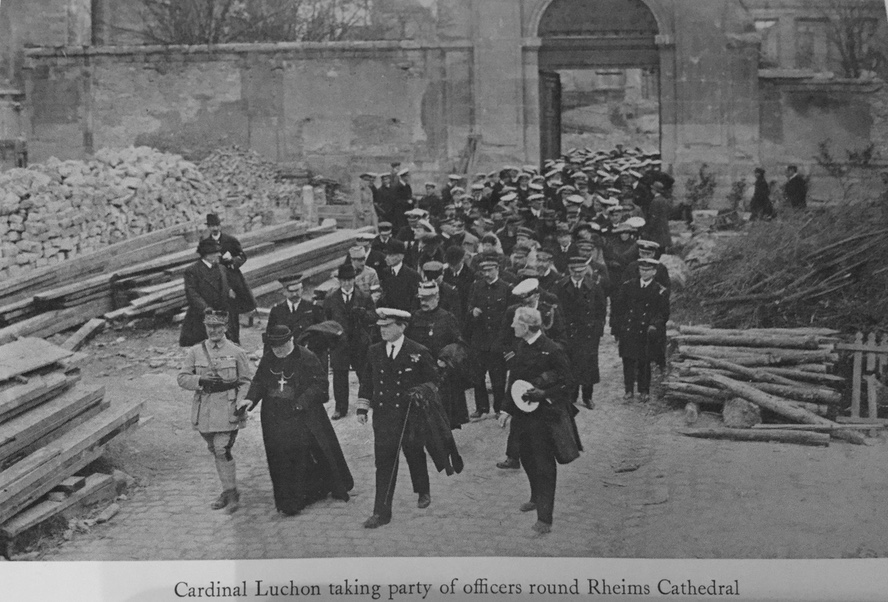

#CHAPTER XV

####THE AFTERMATH OF WAR

The immediate effect of the Armistice was in the destroyer flotilla as much as elsewhere, everything that could be got hold of in any way resembling a firework was let off, and any one who could get hold of the lanyard of a siren pulled it. The canteen party returning to their ships were evidently a bit rowdy. I was rung about midnight by a rather rattled captain in charge in Port Edgar, telling me the sailors were quite out of hand and were threatening to burn his house down. I was sleeping ashore that night, expecting a really peaceful night, but thought perhaps I had better go and see for myself how far the celebrations had got. I walked down through south Queensferry, not a soul in the streets; the first night of peace was not being wasted there. Port Edgar was the same, I was almost surprised to find the sentries walking their posts as usual, no signs of marauders round the captain's house, and I met no one, so the armistice-day celebrations were definitely over. It was one o'clock on the morning of the first day of peace and very much “All well”. But unfortunately there was still an unofficial war in the Baltic, the sort of war that every one particularly dislikes: the country is not in danger, has not been insulted by any one, you are very vague what it is all about, you may get killed but worse still the fruits of your labours, which it was understood came automatically with the Armistice were indefinitely postponed. It was no good telling the sailor it was only an armistice and the politicians had a lot of talking to do before peace was signed. To make matters worse, some rather unfortunate orders were issued, first of all a large class of what were known as “Hostilities Only” people had to go, then an order came through that all “Time Expired” people could be discharged, and I had to go to Sir David, or Lord Beatty as he had then become, and tell him that to carry out the order meant immobilizing the flotillas. The order had to be rescinded as far as the destroyers were concerned, which did not add to happiness.

The whole thing was perfectly natural, the men had in a large degree been in the north for four years, they almost all had their homes in the south. To go south for short leave was expensive, to move wives and families up north for an unknown time was equally difficult. And it so happened one by one the big ships left for their home ports either to give leave or to pay off. The American squadron left; each of these departures meant a muster on the pier-heads of Port Edgar to cheer ship. The cheers began to get a little bitter, for it was not possible to let a single destroyer leave. Things came to a head when it came to the turn of one of the flotillas to leave for a second spell in the Baltic. They were due to leave at three o'clock on a Monday afternoon. At nine o'clock the same day Captain D. came to report that his men were refusing to sail and that a large number of them had gone to London to see Mr. Lloyd George. It transpired that the party had left on Saturday night, but Captain D. had known nothing about it until Monday morning, which was not good. I told him to have every man in the flotilla mustered in the big torpedo shed at noon and I would come and talk to them.

We had a very good meeting, a little jeering and booing at the back by a few very young men who I realized had certainly not served all the war and probably very little of it.

I suggested they should come forward so that we could all see who it was that had had such a hard time that they could not finish the course and were prepared to bring discredit on all the Grand Fleet destroyers. There was a little shuffling and I could see the little party who had evidently come hoping to make trouble were melting into the crowd. I could also sense that ninety per cent of the men present would certainly obey orders whatever their private feelings were.

I ended my little talk by saying that I was sure the flotilla would sail at three o'clock, I on my part would see they were relieved in the Baltic as soon as possible. I then went over to report the position to Sir Charles Madden who had become C.-in-C. in place of Lord Beatty. Sir Charles asked if it would be well if he came and talked to the men, but I suggested I thought it would only add to the importance of the unfortunate business and there had been enough talking. “Moreover,” I said, “I am pretty sure the flotilla will sail at the right time.”

I was disappointed therefore when I got back to my ship to find Captain D. on board with a gloomy face and still apparently confident that his men would not obey orders. He had brought with him, or there had arrived on board, a petty officer from one of the destroyers affected, who wished to see me. This man asked for permission to address the men; and when I asked why particularly, he said he thought he could persuade them to sail. “And what makes you think any one is not going to sail?” I asked him.

He was a very wordy person and I let him run on, trying to make up my mind whether he was a real villain or only suffering from extreme egotism. At the end of his long explanation of what he would say and how he would persuade the men, I told the first lieutenant to put him under close arrest, which had much the same effect as a cold sponge might have on a rather intoxicated gentleman. We went fairly closely into this P.O.'s history; there was nothing against him; he seemed merely to have a great opinion of himself as a talker. A curious case; he might have done a lot of harm, but I don't think he meant to.

It was satisfactory at three o'clock exactly to see the first ship come astern, and the flotilla sailed. That episode was over, it should never have happened, had the officers from Captain D. down been in closer touch with what was going on. It was the fashion just after the War, a fashion which unfortunately prevailed for many years, with disastrous results, that it was useless to address any grievance through what is known as the proper service channels. The officers were perhaps looked on as poor devils in a worse plight than themselves and therefore no use in such matters. It was necessary, they thought, to get hold of a Member of Parliament and above all Lloyd George; to the sailor or a certain section of them the latter was a man you could get anything out of if you could get at him.

And it was this feeling that influenced thirty-five misguided men to go off to London to see Mr. Lloyd George and get him to stop them going to the Baltic. They were of course returned and I had the unpleasant task of dealing with men whose work I had known intimately for the last two years, and whose ideas that they should have leave at once I had every sympathy with. I am glad to say that when peace was ultimately signed it was found possible to reduce or terminate the sentences these men received which were necessarily heavy.

In January 1919 the Jerram committee was convened to consider the rates of pay in the navy. Lord Beatty appointed me as chairman of a Grand Fleet committee to make suggestions on the rates to be paid to all grades on the lower deck. There was a separate committee to consider officers' pay. The C.-in-C. wanted the report to be ready in ten days, which meant hard work. We sat every day from nine till six o'clock, interviewing a mass of witnesses taken from almost every ship in the fleet, and after that I had the work of the flotillas which, although on paper, was still considerable, as we were busy both demobilizing and reorganizing on a peace footing, which took me as a rule well into the next morning; but Woodhouse bore the brunt for he was also secretary of the committee and had the co-ordinating of the day's work as well as the preparation of the next. The work was completed within the stipulated time and the C.-in-C. expressed his approval. It was satisfactory to find when the changes were published that our figures had been taken practically without alteration.

I had, too, at that time a good deal of work with what was known as the post-War committee sitting in London to consider lessons of the War while they were still fresh in every one's mind. Later we paid a visit to Cherbourg and Paris on the invitation of the French Government. We had a most amusing and interesting three days, including a visit to Rheims where we were taken over the cathedral by the heroic Cardinal Luchon. I was very recently back in the cathedral, now rebuilt, and could not help thinking of the old Cardinal and how he would have rejoiced. Rheims at that time could almost be described as a heap of rubble. Sometimes I wonder if the people who are so ready to say Poor Germany, how badly she was treated at Versailles", ever saw a French town or village in eastern France shortly after the War, or ever remember the rows and rows, thousands of them, French dead, English dead, and why? Because Germany marched, and in those days boasted of marching; nowadays they are ready to suggest they marched in self-defence, but not at the time: it was then quite a different story.

I had the good fortune to have attached to me while in Paris a Lieutenant Pichon of the French Navy, a charming and most attentive host. Nothing was too much trouble; we were one day motoring down the Bois on our way to lunch, Pichon was apologizing that we should find no ladies at lunch where we were going. At that moment some one remarked on a pretty girl we were passing; in a moment Pichon had stopped the car and was in pursuit of the lady. When he returned he said she was very sorry, she would have been delighted to lunch with the English officers but had an engagement; and he added she was English. I should have liked to have heard her version of this sudden invitation.

Returning from Cherbourg I learnt that there was to be a review of the fleet at Southend, during which time it would not be possible to get much work done; an opportunity it seemed to have a look at the house I had bought, and I asked for leave. Unfortunately perhaps I knew nothing of the march through London to celebrate the signing of the peace treaty. My staff pressed me to come back to lead the destroyers, but it was not suggested by higher authority that I should do so, and I felt I should look rather foolish if I went back and found no place allotted to me, so I remained on leave; the destroyers were led by a distinguised offiver who had however not served with the Grand Fleet destroyers during the War, and when I did get back I found rather an unhappy feeling that the destroyers how had led the fleet at sea all the War, first out of harbour and last in, were relegated to the rear of the procession, and not led by their own officers. However, a matter of small importance and soon forgotten.

After the review the fleet split up to visit various ports. I was to take the flotillas to Bristol and Dublin, but had only just arrived at the latter place when the railway strike of that year broke out. We were sent first to Liverpool and then to Glasgow. At Glasgow we had a busy time and got a train service of sorts running in forty-eight hours, and should have had a complete service running the following day if the strike had continued. As it was, we ran the first through train as far as Carlisle.

Bluejackets rather enjoy a strike; not that they may have any strong feelings about it one way or another, but they enjoy being let loose on unusual jobs, especially if these are on shore. One of the first and urgent duties when we took over St. Enoch's station was to feed and water a large number of horses which had been left by the strikers. Volunteers were called for from the battalion on duty, from those who had some knowledge of horses. That was too easy; the battalion to a man could look after horses. Not so easy to get men who were confident they could drive an engine; the first train was driven by a midshipman who had apparently some previous knowledge, although I never heard where he had acquired it.

The signal boxes required a little study, but signal ratings soon had enough knowledge of what was wanted to work the system in slow time.

The main signal box was a hundred yards or so down the line, clear of the station, and the signalmen passing to and fro were subjected to a certain amount of stone throwing. The yeoman in charge asked for a rifle. “No,” I said, “we don't want any shooting, everything is going very happily." “Oh,” said the man, “I’m not wanting to shoot. I don't want any ammunition but I think a rifle would help,” so he had his rifle and no more stones were thrown.

The strike was soon over and we went off with the fleet to the Mediterranean, where we were at last able to carry out the massed attack as planned before the armistice.

The authorities were a little perturbed as to the number of torpedoes we were going to lose. I could see no reason why we should lose any more than was usual, except that I hoped for a very much higher percentage of hits, and hits sometimes mean a blow from a propeller and a burst air chamber. The attack was successful: ninety torpedoes were fired and a high percentage of hits obtained; other and similar attacks were also successful and I was convinced we were on the right track, but—and it was a very big but—all these exercises were based on North Sea fighting between two huge fleets, each when deployed forming a line twenty and more miles long, something we were not likely to see again for many years, if ever. The battleships of the future with their huge cost must necessarily be comparatively few in number, and they can only operate from few bases and these are well known. Any moderately served enemy must know where a battle fleet is within a moderate limit and in the case of the British Empire with so much that is vulnerable it is difficult to see why the battle fleet should be selected for attack, and taking the contrary position we know only too well after four years' experience how difficult it is for the battle fleet to bring another fleet to action if that fleet is bent on avoiding such action.

Unfortunately, although this might imply we could do without battleships, we seem no nearer that happy time, for reduce your battle fleet low enough either in numbers or quality they will not only be attacked and stand in danger of defeat or be reduced to the useless position of avoiding action.

So it seemed that little of all we had been doing was going to be of great value in the future. It had to be all thought out again, and for choice by some one with plenty of imagination, and not too steeped in the North Sea experience; I discussed all this with Admiral Madden and told him I thought that now was the time to make a change and get some fresh mind to have a look at the many problems obviously coming in destroyer fighting. I had also put on paper that I considered now in peace time the large number of destroyer captains eligible for promotion every half year should have the backing of a Flag officer in command of the flotillas. Rear-Admiral Hodges was appointed to relieve me. Before leaving I put on paper, by the direction of Sir Charles Madden, a few remarks about the composition of destroyer flotillas as derived from the experience of the war.

The gist of these remarks was as follows:

A flotilla should consist of one small cruiser and sixteen destroyers.

The Captain D. should be in a cruiser, because that is the smallest ship in which a really useful staff can be accommodated and the necessary signal and wireless staff housed.

It is necessary in war time for Captain D. to keep a careful plot of every unit of his own side which may be operating anywhere in adjacent waters.

Communication and staff work are perhaps more essential for developing the full value of a destroyer flotilla at the right time than in any other arm of the fleet.

The six-inch guns and steadier gun platform provided by a cruiser are a valuable asset in breaking up counter attacks.

Sixteen destroyers are advocated because that is the greatest that can be conveniently handled by one man.

The Success of an attack should largely depend on the number of targets which can be presented simultaneously. No gun control known is equal to dealing with two or three separate targets at the same time, especially if these targets have all a different rate of change and bearing. Therefore for the safety of the flotilla it is important to keep the number of attacking units as high as possible, for on the safety of the flotilla depends the chance of reducing the time of flight of the torpedo. The torpedo is not a weapon of precision like a gun, and the extremely long range of a modern torpedo may perhaps be a misleading asset. The shortening of the future target line will make it more necessary than ever to go in close before firing. The unit of a flotilla is the division, four destroyers. The flotilla should be divided into two half flotillas each led by a commander.

Destroyer work in war time is hard and continuous, night attacks and night work generally follow on long days on the bridge. Few captains feel able to leave the bridge between sunset and dawn; to do this sort of work over a long spell means youth. As a matter of opinion I do not feel that the R.A.D. or commodore should be much over forty; Captains D. between thirty and forty, and captains of destroyers between twenty-two and thirty-five. I further put forward the view that the command of a flotilla should be considered of greater importance than the command of a battleship, and that they should be selected as far as possible from officers whom the Admiralty may consider as most likely to command fleets later on.

Quoting from Admiral Madden's covering letter to the Admiralty, he says: “I am in full agreement that the ability required and the responsibilities appertaining to a Captain D. exceed those of the captain of a battleship, but the position now held by Captain D. is inferior. Captains should not be appointed to command a flotilla as a first command.” With regard to the admiral's last opinion I would personally be glad to have a Captain D. who had been a half-flotilla leader even if it was his first command as a captain.

To quote again, the Admiral goes on to say, referring to the suggested organization: “This is the ideal organization and the efficiency of the flotillas would be greatly increased for the reasons given by the Commodore.”

However, it was the time of expediency, not efficiency, and it was sad to hear from Admiral Hodges, soon after I left, that in order to find work for Post Captains it had been decided to reduce the flotillas to six ships with a captain in command of each six; no word now of efficiency or the lessons of the war. Nothing to my mind could be more opposed to actual requirements for efficiency. It seems to me essential in peace time to train young men in command, there is no better training ground than handling a flotilla of destroyers or even a division.

The problem of course arises in a service that requires a few senior officers and a great many junior ones of how to keep a fair rate of promotion? But the only standard which can give the Empire what it wants and expects, is efficiency for its defence. It should be possible to convince the Treasury that it is cheaper in the long run to grant maximum pensions to captains immediately it is decided they cannot be further employed with maximum efficiency, than to keep them on half pay or employed in command of ships which should be the training ground of more junior officers. In my opinion, for instance, the employment of a Post Captain to command a sloop or six destroyers is all out of proportion, and very bad for the service.

My only further contention before giving up command was on the subject of guns in destroyers; the guns of a flotilla acting in concert have immense hitting power, another reason for bringing as many into action as is possible simultaneously; but a fast-moving destroyer is an unsteady gun platform, opportunities of close contact soon over, and rapidity of fire is of greater value within limits, of course, than the hitting power of an individual shell. The introduction of the 4.7 gun reduced the rate of fire from eighteen rounds a minute to about eight or nine in calm water. The larger ammunition is just too heavy for a man to conveniently handle with one hand while hanging on with the other, and the rate of fire is likely to fall seriously in even moderate weather. Heavier and larger ammunition means less rounds carried or more room to carry it, heavier guns, heavier mountings, and then bigger ships to carry it all, until we get destroyers as big as cruisers and nearly as costly, and therefore fewer of them.

I would plead to keep down the size and weight and increase the numbers; there are far too few now, there were far too few during the whole of the last war, and the cry for more and more destroyers will go on the whole of the next war should there ever be one.

