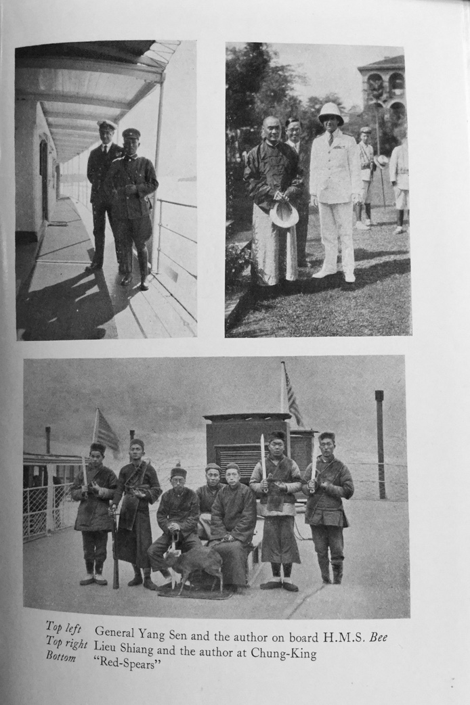

#CHAPTER XVIII

####CHINA 1927-9

In March 1926, being then on half-pay, I was promoted to rear-admiral, and during the summer went through the senior officers' course. There had been considerable trouble going on in China, especially on the Yangtse River. Early in the year we had been forced out of Hankow, or at least had been forced to give up the British concession in that town by a mob; and there had been drawn up what was known as the Chen-O'Malley agreement, the latter representing the British side, Eugene Chen for the Chinese. Eugene Chen was, I believe, a Chinese born and brought up in the West Indies, whose language was English and with some claim to calling himself a British subject—how he arrived in a position to make agreements of some national importance is something of a mystery. The débâcle at Hankow followed by the surrender of all the concessions on the river was perhaps naturally followed by a demand of the extremists to oust the foreigner from Shanghai. But the concessions in Shanghai were either French, or international. The French had not budged in Hankow and were not likely to now. The international concession also presented a different proposition—bigger stakes were involved, although it would seem the principle was the same; different action, however, followed, and an expeditionary force left England, while all nations strengthened their garrisons on the spot. Most of us in the senior officers' course, had experience in China, and there was a good deal of speculation as who was likely to be sent out to the river, a change being soon due. This command was at the moment of great interest but at any time the trouble might subside, and under the peculiar conditions ruling in the navy, it meant that once appointed to a command of this nature, there was little hope of getting back to the fleet, and it was fleet work that attracted me most; I felt that I had happened to have more experience of such work during the War than any one of my seniority, and I was ambitious to go on with the same kind of work. Sir John Kelly told me he had proposed my name for command of one of the battle squadrons, and Sir Roger Keyes had suggested I should go back and command the destroyers once more, a suggestion which very much appealed to me, so that it was without enthusiasm that I received my appointment to China as R.A.Y., an appointment which besides meaning the end of any chance of working again with the fleet, meant a two years' separation for my wife and I.

The compensation was, of course, that the work was likely to be of great interest. I managed to collect Hector Woodhouse again as secretary and with Lockyer as assistant secretary I felt I had a substantial backing.

In October 1927, we arrived in Shanghai, where I took over from Admiral Cameron, learning from him that the state of affairs on the river was about as chaotic as it well could be.

Shanghai itself concerned us little, except as a very pleasant place to visit once a year when the ship had to refit. Sine I was there last, the dredging and widening schemes had been completed, and the C.-in-C. could lay at a buoy off the British consulate in his own flagship. Shanghai came therefore under the immediate eye of the C.-in-C., and with a general commanding British troops ashore it was well cared for. Having reported my arrival to Sir R. Tyrwhitt, the C.-in-C., I called on the general and Sir Sydney Barton, the Consul-General, and made the acquaintance of Mr. Meyrick Hewlett, now Sir Meyrick, who was designate Consul-General at Nanking when that consulate should be reoccupied, and with whom I was to have a great deal of work in the near future. Each and all of these having endeavoured to enlighten my darkness, I sailed up the river in H.M.S. *Bee*, a river gunboat of the Insect class, and a very comfortable ship. I had learnt that most ships passing up the river were fired at, and for no particular reason; at least, as regards the lower river. Farther up, where the firing came from bandits, there was always a hope of hitting the captain or pilot, and the ship getting aground and open to pillage.

My first tour of the river ports was depressing, and there came to my mind the Biblical wail—“How are the mighty fallen.” Everywhere, British interests, once so flourishing, were in a precarious state. All consular officers had been withdrawn, and the consulates closed except at Hankow; and there we had been forced to give up the concession, by a mob, no doubt instigated by Borodin and his Russian compatriots. General Chiang Kai-Shek, even then the hope of China, had been deposed or had resigned office, and was out of the country. There was no Central Government and any number of warring generals, most of them with considerable armies.

My first visit to Nanking was interesting—there were still a few foreigners in the place, and these were collected together in an upper room near the post-office, outside the city walls, and fairly accessible to the bund. I went with Ritchie, the head of the post-office, into the city to visit the deserted British consulates. Ritchie and his wife, whose house stands next door to the consulate, escaped when the latter was attacked by being hidden in a mail van covered with mail sacks, and driven through the city by faithful postal employees. One of the most pleasing characteristics of the Chinese, and one heard it from all sides, was that during all these difficult times, with the constant cry of down with the foreigner—kill—kill, always came tales of loyalty and indeed great risks taken to befriend and save those who had employed them.

The British consulate was completely looted to the smallest detail, even the fire grates and electric wires and fittings had been pulled out and removed. I saw the strong-room where the British ladies in Nanking had a few months previously taken refuge, where the mob broke in, and the lawn in front of the house where one Englishman had been shot, and the Consul-General himself wounded. It was from the consulate the British party eventually escaped to the house of the manager of the Standard Oil Company, situated close to the wall of the city, and where they were closely besieged; the doors being at the point of being battered in when the first shell from the cruiser *Emerald* in the river screamed overhead and the besiegers fled. That same shell saved the life of Mr. Jack who had managed to get out of the city with the hope of guiding the relief party on their way from the ship; he had not gone far when he was caught by a roving band of soldiers, and was actually facing a firing squad when the shell passing over, the squad took to their heels, and so did Jack ; and as he showed me the wall he managed to get over, he said: “If any one had told me I could go over that wall with one jump, I should have said ‘impossible', but I did it.”

Some time later when Nanking was more peaceful, I was lunching with Admiral S. K. Chen to meet the Chinese minister appointed to consider foreign claims for damage. I sat next the minister—a youngish man speaking excellent English—and he attacked me at once as to why my Government did not acknowledge the National Government of China. “Chiang Kai-Shek had by then returned by request of the Kwo Ming Tang and had once more taken charge.” I replied that although of course it had little to do with me, I had actually very strongly recommended that the Government should be recognized, but I added, if you have seen the British consulate here and what we call the devastated area, you must realize that it is difficult for any government to recognize your government until some practical efforts are made to restore the damage. He said he had not seen the damage, and rather scoffed at the whole business. “You have many worse riots in London,” he said. This gentleman was one of those foreign educated Chinese, so well described by Madame Chiang Kai-Shek in her book *China at the Crossroads*; a man whose knowledge of China was confined to Hong Kong and Shanghai. Before the end of lunch I asked him, if he had time to spare, whether he would come with me to the consulate and other buildings.

I took him first to the vice-consulate where even the floor boards had been removed and numbers of horses tethered all over the lower floor, We went over to the consulate and other foreign buildings. He really was much impressed, and left saying this must be put right at once; and he was as good as his word. In a very few months the whole place was restored, and very well restored; and when the Consul-General held a reception there on the King's Birthday, a year later, it would hardly be possible to imagine it was the same place.

In the spring of 1928, it was deemed safe for the Consul-General to return to Nanking, and the Nation Government had provided suitable accommodation until such time as the consulate should be restored and ready for occupation. I went down to Shanghai and embarked Mr. Meyrick Hewlett, the Consul-General, and landed him at Nanking complete with top hat and a fifteen-gun Salute. General Chiang Kai-Shek was not having an easy time. The Russian element had a very strong footing in Hankow. One evening, orders went out and every Russian was deported, and the Russian consulate-general closed. This step, which made little stir at the time, was really a very big step towards the emancipation of China. I made my first visit to Chiang in Nanking; he was still living as a general on active service in a house on the outskirts of Nanking, and closely guarded by soldiers with drawn automatic pistols.

The general is a tall spare man, looks hard, and must be hard to get through the enormous amount of work he does.

Soon after the first interview, Chiang married Mei Ling Soong, a sister of T. V. Soong, the Minister of Finance, and the younger sister of Madame Borodin, the widow of Sun Yat Sen; so that although he married into the well-known Soong family, that family were divided, Borodin and Madame Borodin having been expelled with the Russians.

Hankow was the next centre of trouble. Tang Sen Chi, the general in command at that port, went into rebellion against the National Government. Tang held a position near Tunglin between Wu'sueh and Hankow, where he mounted guns and gave out the river was mined. Most ships were fired at passing this point for a few days, but on the advance of the National armies, the position was soon evacuated, followed by the flight of Tang from Hankow, his armies moving west, in command of Ho Chen, the general in immediate command during the excesses committed in Nanking.

I called on Chiang on his arrival in Hankow to congratulate him on his victory.

I had now to visit Ichang and the upper river. Ever since what was known as the Wan'sien incident, in which Commander Darley and a number of ratings were killed, there had been a boycott on British shipping in this part of the river. General Yang Sen was the Chinese general in command, and I determined to see him and talk it over. At Ichang, however, they told me there was little chance of Yang Sen agreeing to see me; he would certainly have business elsewhere. I got into plain clothes, and taking a small guard took passage in a river steamer, arrived at Wan'sien: I found the prescribed anchorage was some distance below the city, and with a very strong current, it was going to be a long business getting there. However, the American gunboat *Pannay* was anchored near, and learning my difficulty, the commanding officer at once put his fast motor-boat at my disposal. The next difficulty was to find out where Yang Sen's Yamen was, and to secure a reliable guide; it was necessary to go by myself, before the general knew of my presence in the port, and I did not want to be kidnapped on the way. There was one foreigner in the vicinity, an American missionary who went by the name of “Pushful” Parker; the nickname did not at first inspire confidence, but I learnt the prefix did not apply to character, but to the fact that in his church he played a trombone, and the Chinese chop for his foreign name was Pushful.

Mr. Parker came on board, said he knew where the Yamen was, and would secure two chairs with reliable chairmen. Off we went; the Yamen was much farther than I had expected, up the most precipitous pathway, so that one felt one might easily be tipped out of the chair backwards. Chair coolies in Szechuan are quite marvellous men, and appear to be be able to go on up hill and down dale for hours at a stretch, even with a heavy man in the chair. Arrived at the Yamen, we were quickly surrounded by soldiers and escorted to the guardroom. An officer came along, I gave him my card on which was written a short description in Chinese of my business. After not a long wait I was conducted into the inner Yamen or private quarter of the general. He received me most graciously and we sat down to what proved a long talk. I had Mr. Parker with me, a first-class Chinese scholar, who although taking no part in the proceedings was able to tell me afterwards that the interpreter had done his job correctly. Yang Sen, who incidentally had, before the Wan'sien incident, been a good friend to the British, opened at once on that incident, accusing the British admiral, my predecessor, of bad faith.

He said that after the fighting at Wan'sien, when the British gunboat had been driven off, he had retained the two British merchantships in Wan'sien. The British admiral had called a conference at Ichang to which he, Yang Sen, had sent a representative, and that the admiral had opened the conference by stating that he would not hear a word until the ships held at Wan'sien were released, and that either he, Yang Sen, was to send them down to Ichang, or navigating parties would be sent up for them. The ships were sent down and from that day to this nothing more had been heard of the conference. I had to confess to ignorance of this phase of the Wan'sien difficulty, but promised to look up the records at once, and if I found the facts were as stated, I would certainly represent as strongly as I could the position should be amended. I went on to plead that bygones should be bygones, and that the boycott was doing great harm to the trade of the river for both sides. He agreed to do all he could but reminded me he could not control local feeling; a great many people had been killed, and unless some reparation should be made the ill-feeling was likely to continue.

The interview did good, the gunboats at least were allowed once more to coal in Wan'sien, which had been denied them for the last year, and trade slowly returned.

The Wan'sien incident, as it was known, still remains a sore point. It was in fact a chapter of accidents. Beginning from the fact that the wash of a British steamer did capsize a boat and a soldier, perhaps more than one, was drowned, it was possibly, even probably, the fault of the boat, and the Chinese claim that some thirty soldiers were drowned was certainly an exaggeration. Yang Sen put a guard on board the steamer and another which happened to be in the port, and gave orders they were not to leave until compensation had been paid. It was a time of great unrest; when reports came down the river that two British steamers had been captured, and their English officers held captive, demands for the release of these steamers having failed, it was determined to fit out a river steamer, put a naval crew on board, and bring the steamers away. The gunboats on the lower river had not then been fitted to steam the rapids, hence the river steamer, and it was perhaps this fact more than any other that led to the disaster. The *Kiawo* had no wireless, and a portable set was installed.

In the meantime, Mr. Blunt, the Consul-General from Chung-King was hurrying down the river, but unfortunately the *Widgeon* in which he travelled hit a rock, and was considerably delayed. As soon as he got to Wan'sien, he had got in touch with Yang Sen, and a conference was arranged; this was duly reported to Ichang, and efforts made to inform the *Kiawo* with no success. The portable set failed to function, and that ship arrived blissfully ignorant of the conference, or of the presence of the Consul-General. She steamed alongside the first of the steamers, and was receive by heavy rifle-fire from the guard, determined to carry out their orders to allow no one on board. Commander Darie, in command of the expedition, and several others were killed. The fire was returned, and soon became general, the *Widgeon* and *Cricket*, gunboats, joining in, while the soldiers lining the battlements opened such a heavy fire that the *Kiawo* had to sheer off, and return without the steamers but with the British officers.

The worst part of the affair was the projectiles from the gunboats’ high-velocity guns directed at the battlements, meaning a high elevation, sometimes missed or passed through their targets, and landed in villages three miles or so away from the river, causing casualties among people who knew nothing of local events. Naturally the number of casualties grew as time went on. The Chinese had, however a case, and as Yang Sen had said, the inquiry opened at Ichang had abruptly closed, because, as they said the British case would not stand investigation. Actually the fact was that Admiral Cameron had to go at once to Hankow where there was serious trouble, and this was followed by further trouble at Shanghai. I pressed the Foreign Office through the ambassador at Pekin, but the response took the line of - “Let sleeping dogs lie”; actually they may have slept in London but not on the river. I think it was a mistake; it would have been far better for both sides to have explained their case, and a judgement given, and it was not all so one-sided as of course the Chinese case made it.

Resulting from my investigation of the Wan'sien incident, and from my own experience of returning the fire on bandits and soldiers posted on the river banks within a few hundred yards of the ship, I strongly advocated river gunboats should carry howitzers instead of the high-velocity guns now mounted. I also took steps to have the flagship *Bee* fitted to be able to steam the rapids. Actually she had plenty of power, but had to be fitted with more rapidly moving and more powerful steering gear. Going up the rapids, and more especially coming down, it is essential either to turn a corner, or to counteract the effect of a whirlpool, to throw the helm over quickly. The current on the lip of a rapid runs fifteen knots, sufficient to hold up even a high-power ship. I timed the ship on one occasion as being eleven minutes on the lip of a rapid, steaming all out and making no progress. The Chinese upper river pilots are however very clever; slowly, in this case, he edged the ship over until it seemed we must touch the rocks, but actually as we got close in, there was an eddy, and we began to draw ahead. Coming down, the combined current and speed of the ship means thirty knots and more over the land, and there are plenty of thrills. Fog, prevalent often in the early morning, is a danger to a long ship, unable to turn round and head the current.

Some day, when China is once again enjoying days of peace, the three hundred miles of rapids or gorges between Ichang and Chung-King will be a world-wide attraction for tourists; the scenery is magnificent and varies widely with every season of the year.

After a short visit to Chung-King to pay my respects to Lieu Shiang, the Governor of a province having a population of fifty million people, I returned to Hankow, where the Nationalist armies were due to clash with the present occupants.

At this time the whole river above Hankow was in the hands of bandits and robbers, so-called communists, usually defeated and hungry soldiers left far away from their village, and province, and living on the land. The local villages and river trade suffered enormously from the raids of these robbers, often some hundred strong, and many organizations came into being of the self-help variety. The most interesting of these or the best known was “The Red Spears” This organization believed themselves, and the local Chinese believed them, to be immune from bullets. A mysterious faith; the procedure as I saw it was that the headman served all his people out with what looked like a pellet of paper which was swallowed and meant protection from the enemy. They really were useful on occasions: we had the case of a British ship which struck a rock coming down the rapids, and had to be beached to prevent her sinking. Her cargo was got out and piled on the beach while repairs were executed. Local soldiers and inhabitants looted the cargo, until the “Red Spears" came along and took entire charge. There was no more looting, and strangest of all, they would take no payment for their services.

They were also picturesque. We were geared up one night in the rapids: ships cannot move at night in these waters, and the custom is to “Spar moor", a wire being taken out and secured to the rocks fore and aft. Two heavy spars are then run out athwart ships, and secured to keep her off the rocks. We were lying one night in this fashion when over the wooded hills, appeared a long line of what might be likened to fireflies. Eventually they arrived at the ship a party of “Red Spears", each man carrying a torch. They had, supposing we were a trader, come down to protect the ship. They did not appear unduly disappointed at not being wanted, and after a rest relit the torches and away they went. For quite two hours you could still see the lights from the torches twinkling in the woods.

#####PIRACY

Highway robbers and pirates are perhaps the natural and historical result of prolonged civil war in any country; we read that it was so in England and it was certainly was in China, where the civil war was so much more divided up into sections, where there are not two sides or three sides but scores of armies, largely at least semi-independent, owing perhaps a loose allegiance to some more powerful leader, but ready for cash to break away or join an opposite side.

And it was the rebelling generals, on their meeting with defeat which loosed on the countryside the hordes of bandits and robbers which infested China, and which provided continual incidents for our gunboats to deal with and meant a very great degree of watchfulness and knowledge of what was likely to occur in each town or on each portion of the river where British lives were liable to be endangered.

Above Hankow and as far as Ichang, a stretch of 250 miles, there was no civil government in the land, even of the most primitive type, and I believe it is true to say no where was the British gunboat more welcome and not by the foreigners (there were none or practically none), but by the law-abiding Chinese, the agriculturists and especially the river traders, for if the foreign firms suffered from time to time from pirates and brigands the Chinese inhabitants suffer a thousand times more.

It was in this district we came abreast of a cluster of big sailing junks at anchor, and as we approached there was a terrific hullabaloo; so I told the captain to stop and see what was the matter. It appeared that less than an hour ago the junks had been boarded by pirates, looted, and an old man, described as very rich, and two girls had been borne off as prisoners. They, the pirates, had escaped in a tug; it was not strictly our business but the fewer pirates about the less danger to British shipping, which was our business; we gave chase and eventually overhauled the tug but only brought her to before dark by the aid of a long shot to fall abreast of her; as so often happened she ran her nose into the bank, and the pirates escaped before we got up. However, the old man and the ladies were intact, the latter extremely frightened. I am sure they thought we were only a band of superior pirates, and it was a case of out of the frying-pan into the fire. We took the tug and the prisoners back to the junk master, as I wanted to find out how far the tug and tug's crew were implicated and how far pressed.

When we got back, the junk master came on board, a huge man and being winter-dressed in his quilted clothes he looked really enormous. All the interpreters in the ship were mustered, and they all took a hand in the pow-wow - that went on for an hour or more, culminated in smiles and thanks all round, the big junk master making the ladies, now all smiles, realize they were safe, “Kow-tow to me several times, and thank you, master, resounded on all sides,” and that is a phase of the gunboat work which perhaps it is hard for the governing official to understand or if he did, to admit.

The so-called gunboat policy was the greatest godsend to the river dwellers and villages and towns on the river.

The following exchange of signals illustrates an episode, one of many:

*From “Widgeon” at Chang-sha.*
*Telegram from Changteh*

For six consecutive days and nights been under continuous fire, captured, tied up, received painful but not dangerous wounds, eighteen hours suffering outrages. Without necessary food or clothing, then managed to escape to Mission. Looted all personal possessions. Agency wrecked. Stocks depot reported safe. Motor-boat safe, one sailor killed. Catholic Mission completely looted.

There follows a list of foreigners of which there were six men and one woman and message ends, all suffering strain cannot state how we can leave please inform necessary authorities.

*R.A.Y. to “Widgeon”*

Immediate, is there any shallow draft tug available and suitable to man and arm and make Changteh.

*“Widgeon” to R.A.Y.*

Last seventy miles limited to eight-inch draught. No local launch available. Follows a series of questions and answers to different S.N.O.s to find suitable craft.

*Next day from “Widgeon”.*

Have arranged to retain B. & S. tug *Chuchow*, draws two to four feet.

*Telegram from R.A.Y. to “Widgeon”.*

Tell C.G. I agree armed party will only be sent last possible hope of saving life. Have your tug ready it might be possible to meet party escaping. Is it clear attackers are soldiers or local bandits?

Next day more information from Changteh that foreigners were in great danger and must escape. At the same time a welcome rise to three feet and the relieving expedition, consisting of one officer, six men, two Lewis guns and accompanied by the C.G., started.

For three days there was no information, and then came a welcome wireless from *Widgeon* to say *Chuchow* returned with all foreigners from Changteh safe.

It is worth noting that as far as I know only one these foreigners was British

Now besides the danger to the small and scattered communities absolutely dependent on such help and protection as the gunboats could afford them, there was the constant danger to shipping on the river, and this was of two kinds, The most common was parties of brigands firing from the bank; this was pretty constant, annoying but not serious, all the ships plying above Hankow are well protected as regards bridges and passenger accommodation, and the casualties were few.

We had one or two chances of giving this kind of pirates a good dressing-down, although we kept strictly to the rule that we never fired unless fired at. It was annoying to sometimes pass a crowd of these miscreants, no doubt waiting for some unfortunate merchantship, but they would not fire at us.

The same parties sometimes grow bolder, and having brought to a tug by rifle-fire from the bank, board her and operate chiefly against native sailing craft, but have also been a nuisance to the tug and lighter trade mostly in the hands of British or Japanese companies. Two of these tugs we had between us the luck to round up, and although most of the occupants escaped by running the craft into the reeds and jumping ashore, we secured six wounded who were duly shot and we had no more cases of that nature.

Then there is the more troublesome phase of piracy which has been so conspicuous in the outer waters, especially in the Vicinity of Bias Bay near Hong Kong. The method simply means pirates in any number going on board a steamer at any port as passengers, and overpowering the officers and crew after leaving. Generally the gang has made a trip or so in the steamer before, and they find out if there should be any weak spots in the look-out and general alertness of the white officers. When it is remembered that usually there are only two deck officers white men and one in the engine-room, the rest of the crew being native, and carrying perhaps a thousand Chinese passengers, you can imagine the white man in this trade requires sound nerves.

In 1928 the piracy from all methods became somewhat intense, and to make matters worse, they attacked the crews of the light vessels which mark the channels, and the position of which has to be continually changed as the river rises and falls, old channels closing up and new ones scouring out by the current. It was the usual custom for the crew of these light vessels to flag a passing steamer to stop and put a message on board to the nearest river inspector giving information of any radical changes in progress. The steamer having stopped became an easy prey to the robbers, who came off in the Customs sampan belonging to the lightship.

They, the pirates, also became aware that the inspector's boat came round at stated intervals to pay the lightkeepers; as soon as the launch had gone they went on board and relieved the unfortunate men of the pay just received. Naturally the service was disorganized, and the end came when they boarded the launch itself, shooting the master dead and looting everything. The English inspector escaped only by chance on this occasion, having left the launch a few miles down the river.

In consequence of these activities, the whole of the middle river shipping was due to come to a stop; it was by no means all British but a valuable proportion was. I undertook to keep the river open for all trade, this meant very heavy extra work for the gunboats; two had to be constantly sounding channels, moving lightships and buoys, etc., very for which they had no experience, working entirely in waters in which all ships other than H.M. gunboats employ special middle river pilots.

That the work was well done can be claimed, in as much as the shipping was not delayed a single day, nor did a single ship get ashore during the three months before it was again possible for the river inspectorate to recommence duty.

To counteract the firing from the banks and possibly internal pirates, it was necessary to put guards on all British ships and on the worst section between Chenglin and Shasi a bi-weekly convoy was introduced.

While this actively was in progress in the middle river we had a local civil war on the upper river requiring reinforcements and a bad outbreak on the lower river, so that the masters of ships were refusing to move without guards, and at one time we had as many as 150 men away in merchantships on guard duty.

Of course these could not all be supplied by the gunboat crews and the stationery cruiser at Hankow, and I had to appeal to the sympathetic ear of the commander-in-chief, always ready to help at a moment's notice although I've no doubt often voting us a great nuisance in upsetting his plans. It soon became necessary to point out that there was a limit to this guard business, and that the gunboats were seriously depleted and rendered ineffective *pro tem* for their other major duty of insuring the safety of the various British communities.

As soon as possible the lower river guards were withdrawn, that is on the stretch between Nanking and Hankow where an isolated case of piracy had occurred, and rather badly upset the nerves of shipmasters and owners on that stretch.

The case of Captain Lalor, the captain of one of Butterfield and Swires' steamers, is typical of the risks run by ships at that time.

The ship was at Shasi. I had given instructions ships were to sail in convoy unless they were sure of making the next port where there was a gunboat, in daylight.

Lalor's ship had had some engine trouble, which the gunboat captain at Shasi had duly reported, and asked instruction whether she should be allowed to sail for Ichang which her captain was anxious to do, or wait for a convoy of slower ships due to sail in a day or two. My reply was to the effect Lalor could sail if he was sure of making Ichang the same day. Normally this should have been easy; something however went wrong, and the ship was anchored for the night just below the Ichang gorge, at a place called Tiger Creek, having a bad reputation.

That night the ship was boarded, the Chinese quartermaster killed, the ship looted and the master, Lalor, taken off as a prisoner for ransom. I was leaving Hankow at the time, and pressed on up the river, in the meantime getting into touch with the Rev. Tocher of the Scottish Missionary Society, who, I was told, was the most likely man in those parts to be able to get into touch with the bandits. Tocher came forward immediately. The bandits were traced to the vicinity of Shasi; we got a note from Lalor that he was badly wounded and lying in the bottom of a boat where he had been tied up for six days. The bandits asked a very high ransom, and paying a ransom on this sort of demand is, of course, highly dangerous as a temptation to open up a lucrative business. It was possible by taking active steps we might capture the sampan he was in. It was almost certain that with any threat of this sort, the bandits before decamping would kill Lalor, he being shot in the leg not being easily dragged across country. The bandits wanted 60,000 dollars, and whoever delivered them must come alone to a rendezvous by night; a risky business. Moreover, they would only take Mexican dollars or bamboo sticks, a form of money I had never before seen, but sufficiently bulky to make the handling difficult. They were sewn up in sacks five hundred to a thousand at a time; each stick had a chop mark on it of some local tradesman or bank, virtually representing an I O U redeemable for cash or food. Tocher went several times to the rendezvous by night without result and I had nearly given up any hope of success that way and told Tocher that I proposed to search all sampans and junks in the vicinity commencing the next day; no easy job for there were many hundreds of them up the creeks near Shasi. I called on the local general and arranged with him to turn out all his troops, and as far as possible put a cordon round the whole place. It was not a plan I had much faith in, one had learnt that Lalor had already changed hands once and was now in the control of the robbers' guild, a powerful organization, almost sure to have some one in close touch with the local military and a good working knowledge of any plans made. Incidentally, calling on the general was quite amusing; through the local Customs inspector I obtained two chairs, for myself and an interpreter, and away we went through the town, the dirtiest and narrowest streets of any Chinese town I know, and that is saying a good deal. To impress the military gentleman, I had put on cocked hat and epaulettes, not that I think clothes, at least European clothes, do impress the Chinese, but I hoped they might. After pushing our way through alleyways for half an hour or so, I came to the conclusion the bearers either did not were the Yamen was or had been told not to take me there. My interpreter, Mr. Gabb, a man of possibly eighteen stone, had been left far behind, and I made my coolies stop. At length Gabb came up, having parted with his chair. We agreed it was no good going farther, but going back was not so easy; behind us had collected a long line of pack donkeys, each with a couple of big sacks across his back, either we had to be backed into the nearby shops or the donkeys. A large and noisy crowd collected and hurled, I’ve no doubt, highly abusive language at us. It was rather a funny scene: one admiral, English, complete in his nearly best uniform, surrounded by a yelling and remarkably dirty crowd; the only thing in the opposite party which was not making a noise or looking excited was the leading donkey. Something in the donkey's face made me laugh, really entirely at my own thoughts, but it acted like magic; instantly all the abuse stopped and they all laughed, and with one accord pushed the donkeys and their loads against the open shop counter and allowed me to pass. What looked like going to be an awkward affair changed to good humour in a moment. Having found our way back to our starting-point, I learnt the general was in residence not one hundred yards away; I walked in past the usual two sentries with presented automatic pistols and had my interview. Why the procession through the town first remains a mystery, something to do with that mysterious business called “Face”, for I have no doubt it was all arranged. Returning to the ship I found Tocher had had another note from Lalor, who said he could not live long, he had been now six days tied up in the bottom of a sampan, not allowed to move for anything, and with scarcely any food or water. There was a covering message from the bandits to say they would undoubtedly be at the rendezvous that night. Tocher was anxious to try again; I was rather against it, but gave in. This time he was successful, and about ten o'clock, just as I had given orders to weigh, meaning to proceed up the river to look for him, he returned with Lalor, who was in a bad way. We left with him at once for Hankow Hospital, where his leg was successfully amputated and he made a good recovery. On the way down we fell in with another band of pirates this time a group of Jardine and Mathieson's lighters. They had been boarded by a party from a steam tug, and which had only sheered off on our approach. We gave chase and ran the quarry down just before dark, when as usual they ran the craft into the reeds and escaped, or most of them escaped; a little quicker handling of the *Bee* and we should have had them all.

Returning to the case of Lalor, he certainly owed his life Chinese converts who worked hard for him and took tremendous risks, while his firm, Messrs. Butterfield and Swires were most generous and never hesitated to pay any ransom I considered necessary to save his life.

H.M. the King bestowed an immediate honour on Mr. Tocher which I had great pleasure in presenting to him. It was an unsatisfactory case, it should never have happened, and paying large ransoms for kidnapped prisoners is of course the best way to encourage the business. When, however, a life is at stake, and any other way of doing it seems useless, it is satisfactory to belong to a firm that can and is willing to pay. We often used to chaff as to how much the Admiralty would consider we were worth, not sixty thousand dollars I fear.

It is not possible to relate all the incidents in a crowded two years; almost every day some one was in trouble somewhere on our fifteen-hundred-mile beat. But it is necessary to complete the picture, however roughly, to say something about opium and the opium traffic, because perhaps that more than anything else was the mainspring of the constant rebellion against central authority. There had been a time when under foreign supervision, the growth of the poppy had been almost stamped out. In or about 1926, the Council of Geneva was prevailed upon, no doubt by interested parties, to take the control of opium in China out of the hands of the Chinese Customs, and allowed an organization to be set up under the title of “The Bureau for the Suppression of Opium Traffic”. This body may have started on the most excellent ideals; in 1928 it was without exaggeration the terror of the river. The only suppression about it was the suppression of any one else handling opium except the opium police, and as these police were all armed, while the ordinary Customs officials were unarmed, they soon had complete control. Going up the river through Szechuan in the spring, the poppy is a wonderful sight, mile after mile of poppy fields as far as can be seen on either bank, away up on the hillside nothing but poppy worth to the cultivator perhaps two or three cents an ounce. By the time it got to the market at Hankow or Shanghai worth the same number of dollars. The profit for the middleman was enormous, especially if he could evade the provincial export and import tax between provinces. Powerful smuggling organizations came into being, and every sort of expedient was used to get the stuff down duty free. The opium police probably handled the bulk of it, but there were, of course, rivals. British ships were a favourite medium, they were exempt from military search and opium smugglers once on board were fairly safe; the usual practice being to throw it into the river, sealed in a tin and buoyed at some prearranged point, where a confederate was waiting in a boat ready to pick it up. It soon became apparent the opium police were using the gunboats as a safe medium to get the stuff down. H.M.S. *Cricket* arrived at Hankow from up river. The opium police came on board and reported they had reason to believe there was opium on board, and could they make a search. The commanding officer agreed, and a considerable amount was discovered. The vernacular Press made a tremendous case about it, declaring the British gunboats were entirely there for the opium trade, one paper describing me as the head of all the Smugglers.

The next time we came down from Szechuan we were pretty sure to have opium on board, and it was pretty sure the opium police had arranged it should be. Orders were given to have a very careful search, and considerable quantities were found in various places, in the funnel of my cabin fireplace, it being summer, in jam tins in the pantry, the original contents having been removed, in the sick bay and elsewhere.

Orders were given to have all the Chinese on board fallen in and told that unless a confession was made as to who had brought the stuff on board, the whole lot would be dismissed at once. Two boat boys were pushed forward and confessed and were duly put ashore at Chenglin, complaining that they would have their heads cut off. We were anchored for the night at Chenglin, and I happened to notice the Chinese coxswain of my barge going ashore, there was no reason why he shouldn't, but I had never known him to do so unless he was ashore with me on duty. Leaving Chenglin we had another search and found more, in all, about seven thousand pounds' worth, which was burned in the ship's furnace, Before arriving at Hankow I gave orders that nothing was to be said about opium. If the opium police had not been warned, it was pretty certain they would come on board with a request to search the ship. Nothing happened, except it was noted that none of the Chinese on board went ashore; as Hankow was the home of most of them, usually little time was lost before they got off to their homes.

Two or three days elapsed and still no one went ashore, and then apparently the coxswain of the barge and the stoker plucked up courage and went off. I had in the meantime warned the Consul-General what to expect. The next day some of the relations of these boys came off, to say that the men had been arrested by the opium police and had been tortured in prison. I asked the Consul-General to make inquiries, only to get the unsatisfactory reply that no Chinese employed in the *Bee* was held in any Chinese prison, to which I had to retort that if an official could be sent, we would conduct him to the prison where the boys were held. I had explained that I had no desire or intention of defending any one smuggling opium, but a statement should be made as to why these two boys in British employ had been arrested and on what evidence. It was difficult to get any consular action, it was always difficult to get any official, consular or Customs, to face a question involving opium, it was without doubt dangerous. Considerable pressure had to be brought to bear before I could get any reply, but eventually I received a letter from the Consul-General to say that he had been informed by the Commissioner of Foreign Affairs that my boys had been accused of not delivering goods for which they had been paid.

And that was the end, we never heard of them again; they were of course Chinese subjects and subject to Chinese law, and there was no redress. It was said that both were strangled, the usual punishment. A disgraceful case! Almost certainly the men were bribed or ordered to bring the stuff down, the police being duly notified and in due course would ask permission to make a search, and secure some thousands of pounds' worth of opium for perhaps a few dollars. It was curious in this case that except for the arrest of the boys, no notice whatever was taken of the ship's arrival, and opium never mentioned.

Opium was perhaps one, if not the main, cause of the prolonged chaos in the government of China, and the source of wealth to the various semi-independent War Lords by which they were enabled to keep large armies in the field in open or partial defiance of the governing power of the Central or Nanking Government under General Chiang Kai Shek.

Towards the end of six months on the river, I had written pointing out as well as was possible after so brief a survey, the conditions as I found them, and asking for some sort of policy. This letter became known as the “Slippery Slope letter" because I used the simile for what seemed to be the British policy as a man standing on a slippery slope, a footing so insecure that the smallest incident started him sliding down; the policy, if there was one, at the time was to give way whenever threatened by any one, the same action was apparently proper whether threatened by an unruly mob out for loot or more organized military force. Under this policy we merely gave up all the concessions on the river, to the even greater detriment of the Chinese than then seemed probable; although it was obvious then, that the business section and more educated Chinese were fully aware of the folly of continually giving way, while other nations such as the Japanese and the French with similar concessions under similar threats merely strengthened their defences and increased their garrisons. It is perhaps more easy to see now how the elimination of British interests and British influence brought about or hastened Japan's attack on China. It may have been good and correct policy to have given up concession and treaty rights by agreement with a Government of China, but to give up and get out under the threat of sticks and stones, surely did no good least of all to China. At the same time, I strongly advocated the recognition of the Nanking or Central Government as the Government of China, for without a recognized government matters were likely to very quickly go from bad to worse, and even if, at that time General Chiang's hold was still precarious and his writ ran not more than two hundred miles round Nanking, still it was more likely to succeed than anything in sight, and the sooner it had recognition from foreign governments the more quickly was it likely to get control.

In July 1928, General Chiang Kai-Shek informed me his Government were anxious to receive a British naval mission, with British instructors; I had already discussed this proposal with Rear-Admiral S. K. Chen who commanded the Chinese naval forces on the river, and who had been formally naval attaché in London. This proposal gradually took shape, and the agreement was finally signed by Sir Miles Lampson a year later.

In the spring of 1929, Hankow was again in rebellion against the Central Government, and at one time it looked as if a battle would be fought for the city. During the winter months matters had been getting critical, and instructions from Nanking ignored.

On May 8th, the Nanking armies advancing up the river were in touch with the defending armies under General Hu Tsung Tu, Hsia Wei and Taochun, with a backing from Pei Tsung Hsi and Li Tsung Jen, the Kwangsi generals to the south, and Feng Yu Hsiang, familiarly known at one time as the Christian General, was to the north, waiting to come down on the winning side. I have mentioned this episode because it was perhaps the culminating act by which Chiang Kai-Shek permanently established his authority and the authority of the Central Government, and the names the generals then actively in opposition are given because those same names appear recently as united under Chiang in the war against Japan.

On May 8th, the rebelling generals in Hankow were very confident they would defeat the Central Government, invited me to a large luncheon party they were giving, presumably to celebrate in advance; however, for diplomatic reasons I made an excuse. About the hour we were to lunch the firing could be heard a few miles down the river. Six hours later, the Hupeh armies were in full retreat. About five o'clock when it was known the retreat had begun there was something of a panic; thousands of Chinese with all their worldly possessions piled high in rickshaws rushing for the French and Japanese concessions.

The authorities in these concessions quickly closed the barbed-wire gates always ready, which caused an ugly rush back to the ex-British concession, and it was necessary to order every available man to stand by in case British residential property was rushed by the crowds.

As is usual on such an occasion, all sorts of wild rumours were being circulated, and at length I thought the quickest way to sense what was going on was to take a quick walk round French and Japanese concessions. It was an interesting experience, and could be likened to an ant-heap when some passer-by had thrust his stick into it, the crowd were quite harmless but thoroughly frightened.

We had an anxious night as the retreating armies were passing all night along the back of the town, making for two bridges which had been thrown across the Han River.

The three generals retreated as far as Shasi where we had a gunboat stationed, and her captain wirelessed me that they—the Chinese generals—sent a personal appeal to give them refuge and safe conduct down the river, to which Í had to reply that this could not be done unless by agreement with General Chiang Kai-Shek. Rather to my surprise I received an appeal from the latter to remove the rebel generals, thereby as he said putting an end to the civil war. As both sides were in agreement, the three generals were taken on board H.M.S. *Cricket*, who brought them to Hankow, where we transferred them to the *Ladybird* who took them to Woosung. I had stipulated a passage to Shanghai only, and no further responsibility for their safety. Arriving at Shanghai, however, nothing would induce them to land, as they said they would certainly have their heads removed. Lieut.-Commander Plowden very tactfully ran alongside a British steamer in Woosung bound south, and induced a somewhat unwilling master to take his embarrassing passengers. A cheque for ten thousand dollars was also sent to me, and equally tactfully intercepted and returned, although I was informed I got no credit for my action, the generals merely considering I was playing for better terms.

Chiang Kai-Shek, after spending a week in Hankow, where I renewed my acquaintance with him, went on to Changsha and was back in Nanking by the end of the month in readiness for the State funeral of Sun Yat Sen due on June 1st. For this ceremony warships of all nations had assembled in the river together with the diplomatic representative of all nations from Pekin. It was of necessity a great occasion, not only was it the State funeral of a very remarkable man, the creator of the revolution and the overthrower of the Manchus, but it was the first great State function of the newly recognized Central Government. The day before the funeral we passed solemnly before the embalmed body of Sun Yat Sen, and afterwards went to a reception given by Marshal and Madame Chiang. It was the first time I had met the latter; she is a very striking personality, and much impressed every one with the easy and gracefull way in which she received the various foreign ministers and admirals, and her great command of foreign languages. For the funeral itself, we left the ship about two-thirty in the morning, the late-departed had to be well on his journey before sunrise. A curious spectacle as we assembled in the dark, the picturesque coffin bearers, from some special clan in the north of China, men of great strength. The coffin of bronze was reputed to weigh over a ton, and the distance was some seven miles to the Purple Mountains where a great mausoleum had been built adjacent to the Ming Tombs.

It was June, and as the sun rose the heat was severe; we weakling foreigners were allowed to fall out about seven o'clock and were conveyed in motor-cars back to the British consulate for breakfast, our places in the procession being taken by soldiers. We rejoined some two hours later, by which time the coffin was just commencing the ascent of the thousand steps up to the tomb. While at Nanking this time I was able to settle the final details with Admiral Chen with regard to the naval mission, and especially to the sending of twenty-five Chinese sub-lieutenants for training in England. I was very anxious to get the latter agreed to, there was so much anti-British propaganda in China, the sources were well enough known that I felt if only we could get through get a steady flow of Chinese naval officers through their courses in England, and they were well treated there as it was certain they would be, they would find that England was not the terrible place interested parties endeavoured to make out, and they would return to China, whether remaining as naval officers or not, have seen for themselves, and likely to be the very finest ambassadors Great Britain could have, when the enormous expansion in all conditions of trade must occur in China.

After Sun Yat Sen's funeral, Sir Miles Lampson visited Hankow. General Ho Ying Chin, Chiang Kai-Shek's chief of staff, was now in command. Both Sir Miles and I had been shooting with him the previous winter and he gave us a warm welcome and a dinner in General Yang Sen's old house, where so many executions were carried out in the days of the Russian occupation.

General Ho Ying Chin is still the chief of staff to the Chinese forces operating in defence of China against Japan.

From Hankow I was glad to be able to take Sir Miles across the Tung Ting Lake to Changsha, the first British minister, for that matter the first foreign minister of any nation, to pay a visit to Hunan Province. The visit was a great success: I note in my diary that lunch with the Governor lasted three hours, and that it was the hottest day of the year so far. Sir Miles had intended to come with me up the rapids to visit Governor Lieu Shiang. However, it was necessary for him to return to Nanking, while I proceeded up-river for the last time, for my two years on the river was drawing to a close.

As I passed down the river from Chung-King, visiting each port on the way down, I was really astonished at the hospitality and expression of goodwill shown me as representative of the British gunboats on the river, and not only by the British community but by all foreigners, and by Chinese themselves. One literally had to eat and drink one’s way out of China, while the firework display with crackers as we left Hankow would have done credit to anything at the Crystal Palace.

Even at Shanghai, where one might suppose I was unknown and from where the river and the river ports always seemed so far away, I had a succession of lunches and and dinners and another firework display as I finally left in the P. & O. for England. I was much touched by receiving a beautiful silver model of an old-time war junk from Mr. C. T. Wang, the Minister for Foreign Affairs, with an accompanying note to say that although he had often objected to the policy of foreign gunboats on Chinese inland waters, as a token of the personal regard for myself. he wished to add to my flotilla. The inscription in Chinese under the junk reads “Shining Flag towards Sea Kingdom” the poetic way of China saying I was going home. My friend, Admiral S. K. Chen, who had by now become Minister of Marine, sent me a very beautiful ivory carving, a memento as he said of our work together in China; he also brought on board all the young officers who had been selected to go to England for training under the recently signed naval agreement.

My work in China was ended, there only remained an interview at the Foreign Office in London with the head of the Far-Eastern section, illuminating but disappointing. I gathered there was little of the confidence I myself felt for the future of the National Government of China. I was pressing for a generous policy from England even at some risk, thinking of what General Chiang Kai-Shek had said in one interview: “We must raise a large loan, and we want to build ships in England, but if all doors are shut we may be forced to go to Russia.” China with her four hundred millions, at a low estimate for there can be no accurate census, of hard-working thrifty and clever people, must in the not far distant future be one of the world's greatest markets for manufactured goods of every description, the friends of China in her adversity will surely reap the reward as her prosperity returns; that is taking perhaps the selfish point of view; personally, I came away with an unbounded admiration for General Chiang Kai-Shek and his handful of ministers, who in spite of continual rebellion and the breaking away of disaffected generals worked in two years almost miracles in the development of roads and general communications and the rebuilding of towns and cities. That all that work has since been destroyed makes no matter, for the one thing lacking in Government circles, loyalty to the central authority has it seems been secured by Japanese action. The final words at the end of the Foreign Office interview perhaps impressed me more than anything: “I have always great difficulty in distinguishing one Chinese name from another, and one province from another, and I have always regretted that I have never been in China.” This from the man who was primarily responsible for the policy and good relations between Great Britain and the teeming millions of China; it seemed almost unbelievable and rather sad.
