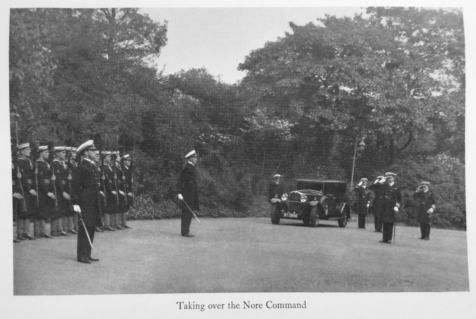
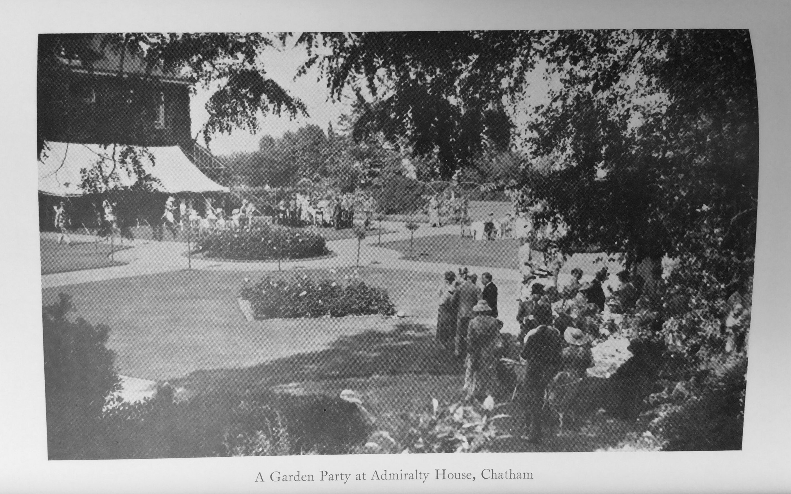

#CHAPTER XX

####THE NORE COMMAND

I was very fortunate to be appointed to the Nore Command immediately on leaving the Cape.

True it was a final appointment; it is very rare for an admiral to be employed again after commanding a Home Port. My time in South Africa had been financially a strain, and two more years on full pay before retiring was from that point of view alone very welcome. On the subject of our financial troubles at the Cape, His Majesty the King was amusing. During the usual interview I had on return home after giving up command he said: “They treated you rather badly about pay, I fear.” “They were a bit sticky, sir,” I replied. “Sticky, you call it; they had spent all their money, they hadn't got any left.” Again I was much impressed at His Majesty's knowledge of what had been going on in South Africa. He was keenly interested in the Tielman Roos Coup which had taken place just before I left the Cape, and had in fact paved the way, together with the Banks, for a Coalition Government and South Africa abandoning the Gold Standard to which she had clung so long.

The command of a home post in peace-time was much as I expected to find it. Socially it is very nice indeed. I cannot recommend the climate of Chatham in winter and early spring, it seems to have more than its just share of east wind and fog, and the first one nearly proved too much for my wife who had a very serious bout of Pneumonia and pleurisy, and it was only the skill and devotion of Dr. Shelly, so well known at Chatham, that pulled her through.

This was a period when a portion of the press and a good many public men were stating that the days when the British Empire required a strong navy was over, and every sort of device was indulged in to scrap ships and get rid of officers and men as cheaply as possible. Politicians covered this inglorious business by claiming they were setting a marvelous example, and they certainly were. No service can go on being continually told how useless they have become, by seemingly responsible people, without it making some impression.

One felt that a species of dry rot might well develop in the navy itself, and as a counter-measure in a small way I got together as many as possible of the men and officers in the big canteen and talked to them about the general world situation, but mostly to reassure them that the scale from the eyes of the nation's leaders was bound to fall, and that they and every one would realize that the Empire needed the navy, and a powerful navy, now as much as ever in her history.

But it was our good friend Signor Mussolini who really did it. The nation, indeed the Empire, owes him a debt which even now is not fully realized. We might well have gone on sleeping until it really was too late.

Suddenly Chatham woke, and became once more a hive of industry; ships in reserve were to be commissioned, and were to sail in ten days: Malta was in danger, hundreds of tons of barbed wire and other stores were to be shipped out, ammunition of all description was required; suddenly the policy of “War not possible for ten years” was changed to “ten days”. No wonder there was a shortage, and things had to be which were in no sense desirable; but it was done: ships rusting gently in the dockyard basins, waiting in some cases for the actual date of despatch to the shipbreakers, and that date depending as much on the state of the scrap market as on naval requirements, suddenly galvanized into life; officers and men realized that the time had come and they were again wanted. If ever a man deserved a niche in St. Paul's surely it should be Mussolini who woke the Empire in time to its own folly. In another year or so he might well have acquired complete control in the Mediterranean without disturbing the sleeping beauty.

This was the time too when perhaps, or at least it seemed to me, the worst mistake in policy made for a long time was coming home to roost, the use of the bomb dropped from the air as a weapon of coercion. It has been recently repeated that such action is never taken without twenty-four hours' warning to the tribes to get out of their houses. Japan says the same to the people of Canton; somebody says the same to Barcelona; and massed murder goes forward under all sorts of plausible excuses, and always we have the unhappy feeling of having been first in the field, since the lessons taught by the Great War.

I was particularly anxious about the vulnerability of Chatham to air attack. It was easy to take certain steps in the dockyard, but as that dockyard is divided from the civil population of the three towns by a matter of yards or the thickness of a wall, it was obvious the whole must be organized as one.

I invited the Mayors of Chatham, Gillingham, and Rochester as well as the representatives of Sheerness and Queenborough to meet me at a conference at which I explained to them what was in my mind. I told them of the necessity of being able to darken the whole of the towns simultaneously and immediately. I talked of balloon barrages of which I had some experience in Venice, and of refuges for the the population of their towns.

They were impressed and asked me to call a public meeting to be held in the Guildhall at Chatham which the Mayor offered for the occasion. The date was arranged, but in the meantime I reported to the Admiralty what was intended, only to be told that Mr. Ramsay MacDonald was horrified at the proposal and that I should create a panic throughout the country. That was four years ago; now we quite happily accept A.R.P and it seems there is no panic. The public meeting had to be cancelled but I was determined that we should not be caught out quite unorganized, and with the whole-hearted support of all the civil authorities a comprehensive “black out” of the three towns and Sheerness was arranged and carried out, the first since the War, and a great deal was learnt. Unfortunately the aircraft which were to have come from Manston failed to arrive owing to low cloud and poor visibility, which was in itself a public lesson, as on the ground level the visibility was very good indeed. I moved about among the crowds during the period of darkness for I was interested to hear the general tone of the comments made, these were universally favourable and people were quite upset if they thought they detected a light showing.

Following this exercise it was obvious that all Kent and the Essex shore of the Medway must be organized under one authority to produce real efficiency. I have no doubt that this has now all been done. Growing out of the changed outlook towards the naval service, the accommodation of young seamen became acute, it takes longer to train a seaman than it does to build a ship; if there was to be an increase in the number of ships in say three years time, no time must be lost in training the men who will eventually man them. The long-derelict gunnery school at Sheerness was reconditioned as a training establishment for direct entry seamen.

During one of the annual Navy Weeks at Chatham, I was standing on the deck of the monitor, *Marshal Soult* a sister ship to the *Marshal Ney*, when a party of German officers were introduced to me. These officers had come specially from Germany to see how our Navy Weeks were conducted. The party were headed by Captain von Shroeder who asked me if I had been captain of the *Marshal Ney* on the Belgian coast, for he said: “I was commandant of the Tirpitz battery,” and he added, “I have never before seen so much of a British monitor.” “We never saw anything at all of your battery,” I replied, “except the flash of your guns when they fired.” “You made very wonderful shooting,” he answered. “But,” I said, “we never managed to actually hit a gun.” “No, but you landed on the parapet often and many men were killed and wounded.” And then he added: “But how many times did we hit you?” “Not at all,” I replied, “but you were very close and if you had scored a hit I should not be here now.” He appeared disappointed and said the other batteries should have done more. Curious, it seemed, that I should be talking to the man with whom I had had so many long-distance duels.

In December 1935 I hauled down my flag. I was fifty-nine and could by the regulations governing retirements remain on the active list for some time, but the First Sea Lord had told me, and it was pretty obvious, that there was no further employment for me, and I sent in my papers—at least that I believe is what it is called—actually I asked to be placed on the retired list, adding the request that I hoped the polite fiction that I was retiring to make room for more junior officers need not be employed, for actually I was retiring because I could see no chance of further employment. I confess I had found the work at a home port much as I had expected, with exceptional episodes of interest. It consisted of routine paper work, a large and growing proportion of the papers on the most unimportant subjects having to be forwarded for their lordships' consideration knowing well enough that their lordships never did or ever could find time to consider such details. I did what Kipling so aptly advised should not be done: I took my pen and had the honour to suggest that I had now a considerable experience in the service, that I was an expensive official and that I had a large and capable staff; it seemed that the Admiralty departments might be saved an immense amount of paper work if the C.-in-C. was allowed to use his discretion in matters on which he was possibly better able to judge than the particular official who actually gave the decision. The suggestion, as I expected, was not at all happily received; and junior officers who sometimes think perhaps they are the only ones kept strictly in the narrow way might be refreshed to realize that even after forty years' service, it is possible to hear exactly what your limitations are.

And so I ended my naval career—forty-six years—and looking back on the ups and downs of it, possibly as a profession there is nothing to equal it if luck goes with you as it did with me. There are still long spells certainly in the first ten or fifteen years of service before real responsibility comes along, when it all seems a waste of life, and by the very nature of the profession there is bound be a high proportion of what the world might consider failures—men who, able and experienced, have given the best part of their lives to the naval service, and yet not have much to show for it. This must be so, it seems; even now it is something of a joke in the service that it is not unheard of to find four ships in company, and three out of the four flying admiral flags; and yet the proportion of cadets who enter, to those who eventually fly their flags, is very small. It seems that there might be some scheme for substantial compensation for men who give twenty to thirty years of service to the country, but who cannot by reason of the narrowing neck of the bottle get beyond a certain limit; for it is on the continued supply of the right kind of officers in the navy that all other business in the Empire depends. The only other appeal I should like to make is for the officers' widows, and this is a matter the navy itself should look to.

I had long been impressed with the position of a naval officer's wife, who shares his service life, which if a successful one brings with it definite assets to her; but in any case while he is alive, the life, if not one of affluence, is at least interesting.

But should anything happen to the husband, instead of sharing the pension he has earned, she is reduced to perhaps £90 a year or less, often just at a time when expenses for schools and possible careers are highest.

One can quote any number of cases of individual hardships, from the widows of admirals down to lieutenants, and it seems to me a slur on the navy that they should let these shipmates’ and messmates' wives come to such straits, merely because they will not organize against it. The usual criticism of the civilian is “Why not adequate life assurance?” The reply to that is, a naval officer's pay will not permit him to pay annual premiums of sufficient value. But if he cannot do it individually he could do it collectively; a penny a day from every officer from his date of commission, rising perhaps to as much as sixpence a day according to rank, and starting at a slightly higher rate for those officers, like doctors, who
join at a later age, would provide a fund after ten years sufficient to provide not less than £300 for every naval widow. The Indian Civil Service have long done it, many big firms I believe do it, and I can see no reason why a comparatively small and compact service like the navy should not do it. It is not a case for the taxpayer, but for the naval officer himself.

With the good will of the Admiralty, and a small salaried staff attached to the Paymaster-General, the expenses of administration should be very small, and no naval officer should have the distasteful experience, as most of us must have, of meeting widows of former shipmates living in great straits.

In conclusion, I should like to say that any account of any incident I have described, is how it impressed itself on me. It is quite possible that the same incident or episode may have appeared differently to others having equally good chances of judging. It is hoped that nothing in this narrative of a naval officer's career could give offence to any one, but should it be considered that any remark I have made is not quite fair to some individual or group of individuals, I hope my apologies may be accepted in advance, for if nothing can be so perfect as to be above criticism, the naval service is very good; the problem of the future is, I believe, the right handling of the personnel. Happiness in ship-life cannot be obtained by relaxation of discipline, but it can be brought about by the closest sympathy between officers and men.
